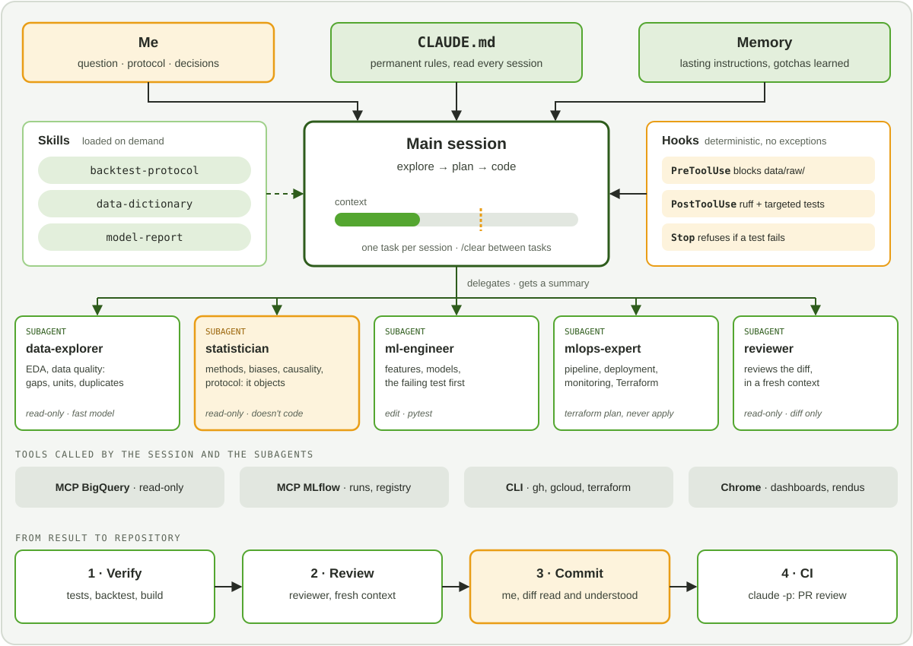


An agent that writes code faster than I do didn't make me a better data scientist. What made
the difference is the method I built around it: knowing what to give it, what to ask of it,
and above all what to check.


*Reading time: about 27 minutes. No prior knowledge of Claude Code needed: every feature is
explained the first time it appears.*



Claude Code is a coding agent that runs in the terminal. Unlike a chatbot, it doesn't just
answer: it reads the project's files, runs commands, edits code, runs the tests and iterates
until the work seems done to it. That "seems done" is exactly what calls for a method.

I use it every day: for my data science and ML-AI engineering projects, for my research
notes, and to build this blog. This post describes how I work with it. It is not an
exhaustive feature guide: the [official documentation](https://code.claude.com/docs/en/best-practices)
does that better, and it changes every week. It is the method I settled on, with its reasons.


**In short.** My method comes down to five rules:

1. **Context is the scarce resource**: one session per task, and I start over rather than correct three times.
2. **CLAUDE.md stays short**: it only holds what the agent can't guess.
3. **I explore and plan before coding**, as soon as a task touches several files.
4. **Nothing is done without proof**: a test, a build, a screenshot, never an "it's done".
5. **I stay responsible for every line**, and I decide every commit.


## 1. Why I needed a method

*Vibe coding* is a way of programming where you describe what you want, accept the code
without reading it, feed the errors back to the AI and repeat until it works. For a throwaway
prototype, it's very effective. For a forecasting model that will drive real decisions, it's
a disaster waiting to happen.

Two practitioners drew the distinction I use as a compass. Simon Willison first, in
[a March 2025 post](https://simonwillison.net/2025/Mar/19/vibe-coding/): if an LLM wrote the
code, but you reviewed it, tested it thoroughly and can explain to someone else how it works,
that's not vibe coding, it's software development. Then Kent Beck, who talks about
[*augmented coding*](https://newsletter.kentbeck.com/p/augmented-coding-beyond-the-vibes): in
vibe coding you only care about the behaviour of the system; in augmented coding you also care
about the code, its complexity, the tests and their coverage.

My rule follows from that: **I am responsible for the code produced, however it was
written.** If I can't explain a line, it has no business in a public repository. The rest of
the method exists to keep that rule without losing what the agent brings.

And what it brings is real: in a week, a well-framed agent makes it possible to write an
implementation from scratch, a full backtest, dozens of tests and teaching notebooks. But part
of that work consists in **contradicting** what was announced, by the agent and by the
sources alike, and that is what gives it its value. More on that below.

## 2. Context is the scarce resource

This is the principle everything else follows from, and the official documentation says so
from the outset: the context window fills up fast, and performance degrades as it fills.

### What context is

The context window is everything the model "sees" at a given moment: my messages, its
replies, every file it has read, every command output. A debugging session or a codebase
exploration can use tens of thousands of tokens. When the window is full, the agent forgets
earlier instructions and makes more mistakes. Before I've even asked anything, part of it is
already taken by the system instructions, the tool definitions and the project's CLAUDE.md.

The analogy that works for me, as a data scientist: context is an **attention budget**. Every
file read "just to see" is an expense. A 2,000-line log pasted in full dilutes the three lines
that matter.

### My reflexes



I start every independent task with `/clear`, which resets the context. Mixing "fix this
bug", then "by the way, what do you think of this chart?", then going back to the bug is what
the documentation calls the *kitchen sink session*: a context full of noise.


If the agent gets the same thing wrong twice, I don't correct it a third time. The context is
already polluted by failed approaches. I start a clean session, with a better first message
that includes what I learned. It's counter-intuitive, and almost always faster.


Pressing `Esc` twice, or `/rewind`, takes the conversation and the code back to an earlier
point. A failed attempt is erased instead of staying in the context as a counter-example.


In a long, useful session, `/compact` summarises the history to free up space. I tell it what
to keep: `/compact keep the list of modified files and the test commands`. An automatic
summary loses details, and not always the ones I would have chosen.



### Write the state to disk

The corollary is never to let the context be the only place a decision lives. Whatever must
survive the session goes into a file: the plan in a `PLAN.md`, the protocol in a versioned
YAML, the conclusions in the `README`. I commit often. A session then becomes disposable: if
it goes off the rails, I close it, and nothing important is lost.

For a modelling project, this matters most for the protocol: I write it in a versioned YAML
**before** seeing a single result. Nobody, neither I nor the agent, can tweak it afterwards to
flatter a number.

## 3. CLAUDE.md: what the agent can't guess

`CLAUDE.md` is a Markdown file at the root of the project that Claude Code reads at the start
of every session. It's where conventions, commands and gotchas go. It is the most powerful
lever, and also the easiest to waste.

### Short, or ignored

The trap is to put everything in it. A CLAUDE.md that is too long is partly ignored: the
important rules drown in the noise. [HumanLayer](https://www.humanlayer.dev/blog/writing-a-good-claude-md)
gives a useful order of magnitude: frontier models follow around 150 to 200 instructions
with reasonable consistency, and Claude Code's system prompt already contains about fifty.
Their own root file is under sixty lines.

The official documentation suggests a test I apply line by line: *if I remove this line, will
the agent make a mistake?* If not, I delete it.

| ✅ I put in | ❌ I leave out |
|---|---|
| Commands you can't guess | Anything readable from the code |
| Architecture choices specific to the project | Standard language conventions |
| Gotchas and surprising behaviours | Detailed API documentation (a link is enough) |
| How to verify (build, tests) | Tutorials and long explanations |
| The **why** behind important rules | The obvious ("write clean code") |

### A real example: this blog

This blog has its own CLAUDE.md. It doesn't describe Hugo, which the model already knows. It
describes what a developer, human or not, would otherwise learn the hard way:

```markdown
Blowfish requires the `config/_default/` layout. There is **no root `hugo.toml`**
— adding one would shadow this directory.

`themes/blowfish/` is a git submodule — never edit inside it; changes are lost
on update.

**`public/` is gitignored** and must stay that way — it's a build artifact
produced by CI, not source.
```

Every rule carries its reason. This is not a detail: an explained rule generalises. "Never
edit the theme" says nothing about the case where a template needs overriding; "the theme is
a submodule, changes are lost on update" lets the agent work out that it should copy the
template into `layouts/`.

### Treat it like code

I have the first version generated with `/init`, which analyses the repository, then I **prune
it**. A generated version shipped without review always contains file descriptions the agent
would have found on its own. After that, the file lives with the project: when the agent keeps
making a mistake despite a rule, it's often because the file is too long, not because the rule
needs shouting. And when a feature changes, I update CLAUDE.md in the same commit.

### Memory: what I only had to say once

Claude Code also keeps a **memory** across sessions: short notes it writes itself when I give
it a lasting instruction, or when it discovers a gotcha. Mine are modest and concrete:

- **always answer me in French**, including progress updates;
- **the Hugo installed here is a snap package**: its `/tmp` is private, so a check build
  written to `/tmp` "succeeds" without producing anything visible. You have to build elsewhere
  before inspecting the HTML;
- **the development server doesn't always re-render a changed page**: a real build is the
  reference, not the preview.

The last two came from real mistakes. Each cost me time once; memory means it doesn't cost it
twice. I reread these notes now and then, and delete the ones that are no longer true: a wrong
memory is worse than none.

## 4. The loop: explore, plan, code, verify, commit

The documentation recommends four phases. I add a fifth, explicit one, because it is the one
that makes the difference.



In **plan mode** (`Shift+Tab`), the agent reads and answers, but changes nothing. I ask it to
understand before acting: "read `src/backtest/` and explain how the test windows are split".
I often discover at this stage that my request rested on a wrong assumption.


I have it write a detailed plan: files touched, order of steps, how to verify. I annotate it
directly (`Ctrl+G` opens it in the editor) before any code is written. Fixing a plan costs a
sentence; fixing an implementation that went the wrong way costs a session.


The agent implements, following the plan. I iterate on the **diff**, not on the description:
"line 42, why a mean and not a sum?" works better than "the result looks odd".


Tests, build, screenshot. That's the next section, and the most important one.


The agent proposes; I decide. I read the full diff before every commit, and a commit never
mixes two topics. On this blog, when a CSS change touches both the menu and the Projects
page, that's two commits.



### When I skip the plan

Plan mode has a cost. The documentation gives a simple criterion I adopted: **if I can
describe the diff in one sentence, I skip the plan.** Renaming a variable, fixing a typo,
adding a log line: I just ask. As soon as the task touches several files, I don't know the
code, or I'm not yet sure how I would go about it, I plan.

## 5. Verify: the one non-negotiable step

The agent stops when the work **looks** done. Without a way to check, "looking done" is the
only signal available, and I become the verification loop. The documentation puts it bluntly:
if you can't verify it, don't ship it.

### Give the agent a check it can run

My request always includes the means to prove it has been met: a test, a build, a script that
compares an output with a reference. The agent does the work, runs the check, reads the
result and iterates until it passes. And I ask it to **show the evidence** rather than claim
success: the test output, the command it ran and what it returned. Reviewing evidence is
faster than redoing the check.

### Test first, explicitly enforced

By default, the agent writes the implementation, then tests that confirm it. Tests written
after the code tend to test what the code does, not what it should do. For a function that
matters, I enforce the order:

1. "write a test that **fails**, implement nothing";
2. I check that it fails for the right reason;
3. "implement the minimum to make it pass";
4. I review, then we refactor while keeping the test green.

For a metric, that means tests on the awkward cases: a series that is constant over the
training period (zero denominator), a perfect forecast, missing values. For a transformation,
a property to preserve: forecasts that must add up, an output that must stay positive.

### Fresh eyes for review

An agent that has just written code is badly placed to criticise it: its context is full of
the reasoning that produced it. For a serious review, I use a **fresh** context that only sees
the diff and the criteria, and I ask it to flag only what affects correctness. Otherwise, a
reviewer asked to find flaws always finds some. Section 8 shows how to organise this with a
dedicated subagent.

### Never trust a single signal

The most telling example is recent, and it comes from this blog. When I added a callout to a
post, the development server's preview didn't show it. The log said "source changed", but the
page served was the old one. A production build, on the other hand, did contain the callout.
The first reflex would have been to "fix" a problem that didn't exist.

Since then, the rule is in memory: **the build is the reference, the preview is for looking.**
And for the interface, I ask the agent to check for itself in a real browser, using Claude
Code's Chrome extension: it opens the page, clicks the filter, reads the DOM state and takes a
screenshot. That's how it spotted near-white bold text on a yellow background, unreadable in
dark mode, which neither the build nor the tests would have flagged.

### Also check what I'm told

Verification isn't only about code. A plan, an answer from the agent or a paper contains
precise claims: where a gap comes from, how far a dataset goes, how many test windows are
enough to rank two models. Each is a hypothesis, not a fact. I check them one by one, and a
false claim is often the most interesting finding of the project.

That's why my project `README`s have a section "what I correct relative to the plan". It keeps
track of what was announced, what was measured, and the gap between the two.

## 6. What changes in data science and ML engineering

Most advice about Claude Code comes from software development. There, code that passes its
tests does roughly what you expect. In data science, that isn't true: **code can be right and
the result wrong.** The pipeline runs, the tests pass, the metric is excellent… because
information from the future slipped into training.

So I verify at three levels, and the agent needs to know all three:

| Level | The question | How I check it |
|---|---|---|
| **The code** | Does it do what it claims? | Unit tests, edge cases, comparison with a reference |
| **The data** | Is it what I think it is? | Quality checks run on every load |
| **Statistical validity** | Does the result mean what I conclude? | Protocol fixed in advance, baselines, variance across windows, the statistician's review |

An agent is naturally good at the first level, decent at the second if asked, and weak at the
third. That's where my attention goes.

### Data before models

An agent handed a dataset wants to model. I first ask it to **check**: gaps, duplicates,
units, time bounds, consistency of aggregates. Hourly data, for instance, often bears the
mark of daylight saving time: duplicates in spring, a missing hour in autumn. A missing row
raises no error; it silently skews a total. That's the kind of defect a model swallows
without complaint.

My typical request doesn't say "do an EDA". It says: *"before any modelling, list what could
make this data misleading, and write an executable check for each point."* The checks become
tests, run on every load, not a notebook cell you forget to rerun:

```python
def test_no_gap_in_hourly_grid(load):
    expected = pd.date_range(load.ts.min(), load.ts.max(), freq="h", tz="UTC")
    missing = expected.difference(load.ts)
    assert missing.empty, f"{len(missing)} missing hours, e.g. {missing[:3].tolist()}"

def test_total_equals_sum_of_parts(load, total):
    gap = (load.groupby("ts").value.sum() - total.set_index("ts").value).abs()
    assert gap.max() < 1.0, f"max gap {gap.max():.1f} at {gap.idxmax()}"
```

The error message matters as much as the assertion: when the test fails, the agent must be
able to read *where* and *how much*, not just *that*.

What I know about the business goes into a **skill**, a data dictionary: what each column
means, its unit, its known gotchas ("zero sales during a stock-out are not zero demand"). The
agent loads it when it touches the data, and I no longer have to repeat it.

### Leakage, the number one trap

Leakage is information available at training time that won't be available when forecasting.
It makes the model excellent in validation and mediocre in production. An agent falls into it
as easily as a rushed human, and for the same reason: the shortest code is often the code
that leaks.

| Leak | The leaking code | What I ask for |
|---|---|---|
| **Temporal** | `train_test_split(X, y, shuffle=True)` on a time series | A rolling-origin split |
| **Preprocessing** | `StandardScaler().fit(X)` before splitting | Preprocessing inside a `Pipeline`, fitted on the training set only |
| **Imputation** | `df.fillna(df.mean())` over the whole history | A mean computed on the past of each origin |
| **Target** | A variable computed after the event (end-of-week stock) | The availability date of every feature, documented |
| **Group** | The same customer in train and test | A group-based split |

The rule is written in the protocol and in CLAUDE.md, with its reason: **everything that is
estimated must be estimated strictly before each origin.** And it has its test, which I have
written first:

```python
def test_no_feature_reads_the_future(build_features, history):
    origin = pd.Timestamp("2025-06-01")
    before = build_features(history, origin)
    # Tamper with everything after the origin: the features must not move.
    tampered = history.assign(
        value=history.value.where(history.ts < origin, -999.0))
    pd.testing.assert_frame_equal(before, build_features(tampered, origin))
```

This test doesn't check a particular implementation; it checks a **property**. It stays valid
when the agent rewrites the features, which is exactly what you need to keep a fast-writing
collaborator in check.

### A baseline, always, and first

An agent readily suggests the most sophisticated model it knows. I impose the opposite order:
first a **naive baseline**, then the model. For a weekly series, that's "the same week last
year"; for a classification, the majority class and a logistic regression. If the model
doesn't clearly beat the baseline, nothing else matters, and I've learned that before
spending a day on hyperparameters.

The agent's suggestions for those hyperparameters, incidentally, are **search ranges**, not
recommendations. The final choice is justified by validation, not by how confident the answer
sounds.

### Evaluate the way you'll decide

The agent spontaneously reports one number: "MAPE of 8.3% on the test set". That's almost
always not enough. I ask for three things.

- **The right metric, at the right level.** The one that matches the decision: an error per
  product if supply is decided per product, a quantile loss if the decision is about a stock
  level. Never a global average that mixes everything.
- **The spread, not just the mean.** A metric over several test windows, with its standard
  deviation. A model that is better on average but only on two windows out of five is not
  better.
- **A paired test** when I compare two models on the same windows, with a correction if I make
  many comparisons. Without it, I'm very likely to "discover" a gain that is only noise.

This is typically when I bring in the statistician subagent: before looking at the results,
to fix the protocol; afterwards, to tell me what I'm not allowed to conclude.

### Predicting is not explaining

A subtler trap awaits reports. An agent asked to interpret a model readily writes "temperature
**increases** demand by 12%" from a feature importance or SHAP values. These describe the
**model**, not the world. They say what the model relies on to forecast, not what would happen
if you intervened.

My instruction is explicit: **no causal vocabulary in a report without an identification
strategy.** Measuring the effect of a promotion requires a comparison group, an experiment or a
quasi-experimental method, and that's a different question from forecasting. An agent knows
this perfectly well when asked; it forgets when it isn't.

### Numbers come from code, never from the conversation

It's one of my publishing rules: a published number is the output of code that was run and
versioned. Never a value a language model "computed" in its head in a reply, nor a percentage
copied from a summary. In practice, every results table is produced by a command
(`make report`) that anyone can rerun, with:

- library versions pinned in `uv.lock`;
- random seeds fixed and recorded;
- the fingerprint (`sha256`) of the raw data in a manifest, to know what the number was
  computed on.

### Code in a package, notebooks to explain

An agent readily produces two-hundred-cell notebooks with duplicated logic. I separate them:
the code lives in a single, tested Python package; the notebooks call it and exist to
**explain**. An estimation function is written once, and every notebook that needs it imports
it. Notebooks are run and versioned with their outputs, which lets the agent read them,
figures included.

### From maths to code, then to the reference

Translating an equation from a paper into code is one of the tasks where the agent saves the
most time. It's also one of the most dangerous: a forgotten transpose gives a plausible, wrong
result. My rule: every "from scratch" implementation is compared with a reference
implementation, with a gap that is measured and explained. **If the gap is exactly zero, I
suspect a copy**; if it's large, I look for the bug; if it's small, I must be able to say
where it comes from. When there's no reference, I test the mathematical properties: a
projection applied twice changes nothing, a covariance matrix is symmetric and positive.

### From model to system

On the ML engineering side, the difficulty shifts: the model works, and it has to keep
working. Three points come up in every project.

- **The same code in training and in production.** A feature computed in pandas in the
  notebook and rewritten in SQL for production always ends up diverging. I ask the agent for a
  single, tested implementation, called from both sides.
- **Versions of everything.** Data, code, model and parameters are versioned together, and
  every run is tracked in MLflow. A number in production must be replayable.
- **Monitoring.** Input drift, error drift, share of outlier forecasts. The agent writes the
  checks; I set the thresholds that trigger an alert.

For LLM-based applications, the logic is the same, with one more difficulty: the output is not
deterministic. So I build a versioned **evaluation set**, with the hard cases, before touching
the prompt; I version prompts like code; and when an LLM acts as a judge, I first check on a
hand-labelled sample that it judges the way I do.

## 7. Extending the tool without weighing it down

Claude Code can be extended in several ways. The risk is stacking extensions that each
consume context permanently. My rule: **an extension must answer a recurring need.** If I do
something more than once a day, it deserves automation; otherwise, a sentence in the request
is enough.

| Extension | What it is | When I use it |
|---|---|---|
| **CLAUDE.md** | Rules read at every session | Permanent project conventions |
| **Skill** | Procedure loaded on demand (`SKILL.md`) | Occasional know-how: a backtest protocol, a data dictionary |
| **Hook** | Script run automatically at a specific point | What must happen **every time**, without exception |
| **Subagent** | Isolated instance, with its own context | Research or review, to keep the noise out of my session |
| **MCP** | Connector to an external tool | Structured access to a database or a model registry |

### Hooks, because CLAUDE.md is advisory

The difference is fundamental: a CLAUDE.md instruction is advice, which the agent follows…
most of the time. A **hook** is deterministic: a script Claude Code runs itself at a precise
point, for example after every file edit, or before handing back control. Forbidding writes to
`data/raw/`, running the formatter after every edit, refusing to finish while tests fail:
these are rules that allow no exception, so they are hooks, not sentences.

### CLIs before connectors

To talk to external services, I favour the command-line tools the agent already knows how to
use: `gh` for GitHub, `gcloud` for GCP. It's the most context-efficient way. An MCP connector
is worth it when structured access really adds something, for instance querying an MLflow
registry. For a database, access is **read-only**: every query is a real job, potentially
billed, launched by an agent that doesn't have an analyst's caution.

### Unattended: non-interactive mode

With `claude -p "…"`, Claude Code runs without an interface, for example in CI to review a
pull request. The precautions then scale up: allowed tools reduced to the strict minimum
(`--allowedTools`), a dedicated key with a spending cap, and never broad permissions outside
an isolated container.

## 8. A complete example: forecasting demand

To make all this concrete, here is what a complete setup looks like on a typical case:
forecasting weekly demand for 2,000 products, with a pipeline deployed on GCP. It's an example
built for this post. It brings together the pieces described above and shows how they fit.



### What surrounds the session

- **Coming in**, three sources: my decisions (the question, the protocol), the project's
  CLAUDE.md (conventions, commands, the no-temporal-leakage rule) and the memory (gotchas
  already met).
- **On the left, skills**, loaded only when the task calls for them: the team's backtest
  protocol, the data dictionary (what each column means, its units, its gotchas), and the
  model report template.
- **On the right, hooks**, which run without exception: no writes to `data/raw/`, formatting
  and targeted tests after every edit, no handing back control while a test fails.
- **Below, the tools**: BigQuery read-only, MLflow for runs and the model registry, the `gh`,
  `gcloud` and `terraform` CLIs, and Chrome to look at a dashboard.

### Five subagents, five roles

A subagent is a Markdown file in `.claude/agents/`: a name, a description saying when to call
it, the list of allowed tools, the model to use, and instructions. Each works in its own
context and only sends a summary back to the main session.

| Subagent | Its role | Its tools |
|---|---|---|
| **data-explorer** | Explore and check the data: gaps, duplicates, units, series breaks | Read-only, BigQuery; a fast model is enough |
| **statistician** | Discuss methods, biases, causality and the protocol, and object | Read-only; it doesn't code |
| **ml-engineer** | Build features and models, writing the failing test first | Edit, `pytest`, MLflow |
| **mlops-expert** | Design the pipeline, deployment, monitoring and infrastructure | `gcloud`, `terraform plan`; never `apply` |
| **reviewer** | Review the diff in a fresh context and flag what affects correctness | Read-only, the diff and the criteria |

Tools are the real safeguard. The statistician isn't allowed to edit: its job is to argue, not
to implement. The MLOps expert can plan an infrastructure change, never apply it:
`terraform apply` is for me.

### The statistician, in detail

This is the subagent that adds the most, because it plays a role a coding agent doesn't play
spontaneously: the colleague who asks "are you sure?". Its definition fits in a few lines:

```markdown
---
name: statistician
description: Senior statistician. Consult before fixing a protocol, choosing
  a metric or interpreting a result. Discusses methods, biases and causality;
  never modifies a file.
tools: Read, Grep, Glob
model: opus
---
You are a senior statistician, specialised in time series and causal
inference. Your role is to object, not to approve.

For each proposal:
1. Name the implicit assumptions (stationarity, independence, no temporal
   leakage, data missing at random…).
2. Look for biases: selection, survivorship, censoring, leakage, multiple
   comparisons.
3. Separate what is predictive from what is causal. A correlation does not
   justify an intervention decision without an identification strategy.
4. Propose the test or experiment that would settle the question.

Reply with a list of objections ranked by severity, then the questions to
ask the business. If the proposal is sound, say so in one sentence.
```

In our case, here is the kind of objection it raises in the first round. Observed sales are
not demand: when a product is out of stock, sales are **censored**, and a model trained on them
learns to under-forecast precisely the products that run out most. It also asks whether the
effect of promotions should be *forecast* or *measured*: the first is a forecasting problem;
the second is a causal question, which calls for a comparison group, not a better model.

### One turn of the loop



The **data explorer** queries BigQuery read-only and reports: 4% of weeks with zero sales,
some of which coincide with stock-outs; product codes changing partway through the history.


The **statistician** reads this report and the plan. It raises demand censoring, possible
leakage through a stock variable computed after the fact, and proposes rolling-window
validation instead of a random split.


**Me.** I fix the protocol in a versioned YAML: metric, windows, baselines, handling of
stock-outs. The `backtest-protocol` skill provides the structure; the decisions are mine.


The **ML engineer** first writes the failing test ("no feature reads a date after the
origin"), then the implementation. After every edit, the hook runs the formatter and the
relevant tests; runs go to MLflow.


The **MLOps expert** designs the scheduled training pipeline, drift monitoring and the
Terraform module. It produces a `terraform plan` that I read before applying it myself.


The **reviewer** receives the diff and the criteria, without the reasoning that produced it.
The `Stop` hook refuses to hand back control while a test fails. I read the diff, I commit,
and CI runs an automatic review of the pull request with `claude -p`.



### Why split it this way

Three reasons. **Context**, first: data exploration and review read a lot of files; in
subagents, that noise doesn't fill the main session. **Disagreement**, next: a statistician who
objects and an engineer who implements, in two separate contexts, recreate the useful tension
of a real team. A single agent doing both tends to validate its own choices. **Least
privilege**, finally: each role only has the tools it needs.

This split has a cost: each subagent consumes its own tokens, and coordinating five roles takes
more attention than a single session. I wouldn't recommend it from day one. Start with one
session and a CLAUDE.md; add a subagent when a role keeps coming back, usually starting with
the reviewer or the statistician.

## 9. What I don't delegate

The agent does a lot. Some things stay mine, on principle.

- **Choosing the topic and the question.** Knowing which question is worth asking is the job.
- **The protocol.** Metrics, splits, baselines: fixed before the results, in writing.
- **Interpretation.** A metric that improves by 2% over four test windows is not a result; it's
  a hypothesis to test. The agent produces the numbers; their meaning is my responsibility.
- **Irreversible operations.** Deletions, history rewrites, publishing: the agent prepares
  them, I trigger them. Irreplaceable files are committed or backed up **before** it gets
  access.
- **Publishing.** Nothing goes out on this blog unless I've read it and can explain it.

These rules are public, on the [About]() page. Writing them down
makes me keep them.

## 10. The signals that make me change course

Over time, I've learned to recognise a few signals. Each calls for a specific move.

| Signal | What I do |
|---|---|
| The agent ignores a CLAUDE.md rule | I prune the file, instead of adding capital letters |
| Two failed corrections on the same point | `/clear`, and a better first message |
| The agent reads dozens of files "to understand" | I narrow the question, or delegate to a subagent |
| The result is "done" without evidence | I ask for the test output or the screenshot |
| A gap of exactly zero with a reference | I look for the copy |
| A surprising number, in the good direction | I look for the leak before celebrating |
| I make the same request for the third time | It becomes a rule, a skill or a hook |

## Conclusion

Claude Code didn't replace the way I work: it made it more demanding. When writing code costs
almost nothing, value shifts to what still costs: asking the right question, fixing the
protocol before looking, and proving the result is right.

If I could keep only one rule, it would be this one: **nothing is done without proof.** The
rest, managing context, a short CLAUDE.md, planning before coding, exists to produce proof
faster.

Tools change every week; I evolve this method with them. What doesn't change is that, in the
end, the code bears my name.

---

**Further reading**

- [Best practices for Claude Code](https://code.claude.com/docs/en/best-practices), the
  official documentation, continuously updated.
- [Writing a good CLAUDE.md](https://www.humanlayer.dev/blog/writing-a-good-claude-md),
  HumanLayer: the instruction budget and the what / why / how structure.
- [Not all AI-assisted programming is vibe coding](https://simonwillison.net/2025/Mar/19/vibe-coding/),
  Simon Willison, March 2025.
- [Augmented Coding: Beyond the Vibes](https://newsletter.kentbeck.com/p/augmented-coding-beyond-the-vibes),
  Kent Beck, June 2025.
