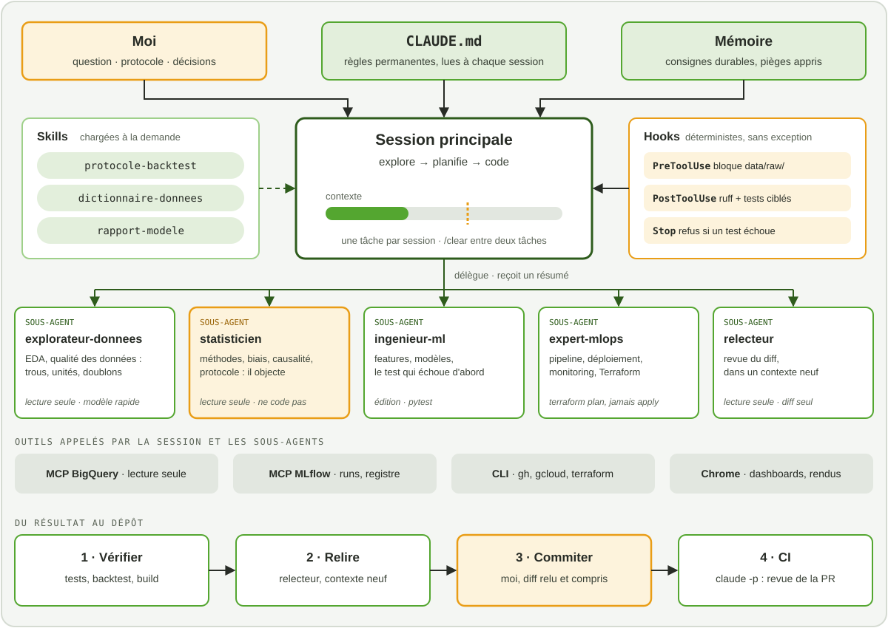


Un agent qui écrit du code plus vite que moi ne m'a pas rendu meilleur data scientist. Ce qui
a changé la donne, c'est la méthode que j'ai construite autour : savoir quoi lui donner, quoi
lui demander, et surtout quoi vérifier.


*Temps de lecture : environ 29 minutes. Pas besoin de connaître Claude Code pour suivre :
chaque fonctionnalité est expliquée la première fois qu'elle apparaît.*


**Note de transparence.** Cet article décrit une méthode personnelle, construite pour
apprendre et travailler. Il a été écrit avec l'assistance d'une IA :

- pour la rédaction et la correction des textes ;
- pour générer l'image de couverture de l'article ;
- pour la relecture technique et méthodologique.

Le choix du sujet, la méthode décrite, la vérification des sources et les conclusions sont les
miens, et j'en assume les erreurs. [Comment j'utilise l'IA]()


Claude Code est un agent de programmation qui tourne dans le terminal. Contrairement à un
chatbot, il ne se contente pas de répondre : il lit les fichiers du projet, lance des
commandes, modifie le code, exécute les tests et itère jusqu'à ce que le travail lui semble
fini. C'est précisément ce « lui semble » qui demande une méthode.

Je l'utilise au quotidien : pour mes projets de data science et de ML-AI engineering, pour
ma veille, et pour construire ce blog. Cet article décrit comment je travaille avec lui. Ce n'est pas un
guide exhaustif des fonctionnalités : la [documentation officielle](https://code.claude.com/docs/en/best-practices)
le fait mieux, et elle évolue chaque semaine. C'est la méthode que j'ai retenue, avec ses
raisons.


**En bref.** Ma méthode tient en cinq règles :

1. **Le contexte est la ressource rare** : une session par tâche, et je repars de zéro plutôt que de corriger trois fois.
2. **Le CLAUDE.md est court** : il ne contient que ce que l'agent ne peut pas deviner.
3. **J'explore et je planifie avant de coder**, dès que la tâche touche plusieurs fichiers.
4. **Rien n'est fini sans preuve** : un test, un build, une capture, jamais un « c'est fait ».
5. **Je reste responsable de chaque ligne**, et je décide de chaque commit.


## 1. Pourquoi j'ai eu besoin d'une méthode

Le terme *vibe coding* désigne une façon de programmer où l'on décrit ce qu'on veut, on
accepte le code produit sans le lire, on renvoie les erreurs à l'IA et on recommence jusqu'à
ce que ça marche. Pour un prototype jetable, c'est très efficace. Pour un modèle de prévision
qui va piloter des décisions réelles, c'est une catastrophe annoncée.

Deux praticiens ont posé la distinction qui me sert de boussole. Simon Willison d'abord, dans
[un billet de mars 2025](https://simonwillison.net/2025/Mar/19/vibe-coding/) : si un LLM a
écrit le code, mais que vous l'avez relu, testé à fond, et que vous savez expliquer à
quelqu'un d'autre comment il fonctionne, ce n'est pas du vibe coding, c'est du développement
logiciel. Kent Beck ensuite, qui parle d'[*augmented coding*](https://newsletter.kentbeck.com/p/augmented-coding-beyond-the-vibes) :
en vibe coding, on ne se soucie que du comportement du système ; en augmented coding, on se
soucie aussi du code, de sa complexité, des tests et de leur couverture.

Ma règle découle de là : **je suis responsable du code produit, quelle que soit la façon dont
il a été écrit.** Si je ne sais pas expliquer une ligne, elle n'a rien à faire dans un dépôt
public. Tout le reste de la méthode sert à tenir cette règle sans perdre le bénéfice de
l'agent.

Ce bénéfice est réel : en une semaine, un agent bien cadré permet d'écrire une implémentation
de zéro, un backtest complet, des dizaines de tests et des notebooks pédagogiques. Mais une
partie de ce travail consiste à **contredire** ce qui a été annoncé, par l'agent comme par les
sources, et c'est ce qui lui donne sa valeur. J'y reviens plus bas.

## 2. Le contexte est la ressource rare

C'est le principe dont tout le reste découle, et la documentation officielle le dit
d'emblée : la fenêtre de contexte se remplit vite, et les performances se dégradent à mesure
qu'elle se remplit.

### Ce qu'est le contexte

La fenêtre de contexte, c'est tout ce que le modèle « voit » à un instant donné : mes
messages, ses réponses, chaque fichier qu'il a lu, chaque sortie de commande. Une séance de
débogage ou l'exploration d'un dépôt peut consommer des dizaines de milliers de tokens. Quand
la fenêtre est pleine, l'agent oublie des instructions données plus tôt et commet plus
d'erreurs. Avant même ma première question, une partie est déjà occupée par les instructions
système, la définition des outils et le CLAUDE.md du projet.

L'analogie qui me parle, en tant que data scientist : le contexte est un **budget
d'attention**. Chaque fichier lu « pour voir » est une dépense. Un log de 2 000 lignes collé
en entier dilue les trois lignes qui comptent.

### Mes réflexes



Je commence chaque tâche indépendante par `/clear`, qui remet le contexte à zéro. Mélanger
« corrige ce bug », puis « au fait, que penses-tu de ce graphique ? », puis revenir au bug, c'est
ce que la documentation appelle la *kitchen sink session* : un contexte rempli de bruit.


Si l'agent se trompe deux fois sur le même point, je ne corrige pas une troisième fois. Le
contexte est déjà pollué par les mauvaises pistes. Je repars d'une session propre, avec un
meilleur premier message qui intègre ce que j'ai appris. C'est contre-intuitif, et c'est
presque toujours plus rapide.


`Échap` deux fois, ou `/rewind`, ramène la conversation et le code à un point antérieur. Une
tentative ratée s'efface au lieu de rester dans le contexte comme un contre-exemple.


Sur une longue session utile, `/compact` résume l'historique pour libérer de la place. Je lui
dis quoi garder : `/compact garde la liste des fichiers modifiés et les commandes de test`.
Un résumé automatique perd des détails, et ce ne sont pas toujours ceux que j'aurais choisis.



### Écrire l'état sur disque

Le corollaire, c'est de ne jamais faire du contexte le seul endroit où vit une décision. Ce
qui doit survivre à la session va dans un fichier : le plan dans un `PLAN.md`, le protocole
dans un YAML versionné, les conclusions dans le `README` du bloc. Je commite souvent. Une
session devient alors jetable : si elle part dans le décor, je la ferme, et rien d'important
n'est perdu.

Pour un projet de modélisation, cela vaut surtout pour le protocole : je l'écris dans un YAML
versionné **avant** de voir le moindre résultat. Personne, ni moi ni l'agent, ne peut
l'ajuster après coup pour embellir un chiffre.

## 3. Le CLAUDE.md : ce que l'agent ne peut pas deviner

Le `CLAUDE.md` est un fichier Markdown à la racine du projet, que Claude Code lit au début de
chaque session. C'est l'endroit où l'on met les conventions, les commandes, les pièges.
C'est le levier le plus puissant, et aussi le plus facile à gâcher.

### Court, ou ignoré

Le piège, c'est d'y mettre tout. Un CLAUDE.md trop long est partiellement ignoré : les règles
importantes se noient dans le bruit. [HumanLayer](https://www.humanlayer.dev/blog/writing-a-good-claude-md)
donne un ordre de grandeur utile : les modèles de pointe suivent environ 150 à 200
instructions de façon cohérente, et le prompt système de Claude Code en contient déjà une
cinquantaine. Leur propre fichier racine fait moins de soixante lignes.

La documentation officielle propose un test que j'applique ligne par ligne : *si je retire
cette ligne, l'agent fera-t-il une erreur ?* Si non, je la supprime.

| ✅ J'y mets | ❌ Je n'y mets pas |
|---|---|
| Les commandes qu'on ne devine pas | Ce qui se lit dans le code |
| Les choix d'architecture propres au projet | Les conventions standard du langage |
| Les pièges et comportements surprenants | La documentation détaillée d'une API (un lien suffit) |
| La façon de vérifier (build, tests) | Les tutoriels et longues explications |
| Le **pourquoi** des règles importantes | Les évidences (« écris du code propre ») |

### Un exemple réel : ce blog

Ce blog a son propre CLAUDE.md. Il ne décrit pas Hugo, que le modèle connaît déjà. Il décrit
ce qu'un développeur, humain ou non, découvrirait à ses dépens :

```markdown
Blowfish requires the `config/_default/` layout. There is **no root `hugo.toml`**
— adding one would shadow this directory.

`themes/blowfish/` is a git submodule — never edit inside it; changes are lost
on update.

**`public/` is gitignored** and must stay that way — it's a build artifact
produced by CI, not source.
```

Chaque règle porte sa raison. Ce n'est pas un détail : une règle expliquée se généralise.
« Ne modifie jamais le thème » ne dit rien du cas où il faudrait surcharger un gabarit ;
« le thème est un sous-module, les modifications sont perdues à la mise à jour » permet à
l'agent de déduire qu'il faut copier le gabarit dans `layouts/`.

### Le traiter comme du code

Je fais générer la première version avec `/init`, qui analyse le dépôt, puis je **l'élague**.
Une version générée et livrée sans relecture contient toujours des descriptions de fichiers
que l'agent aurait trouvées seul. Ensuite, le fichier vit avec le projet : quand l'agent
répète une erreur malgré une règle, c'est souvent que le fichier est trop long, pas qu'il faut
crier plus fort. Et quand une fonctionnalité change, je mets le CLAUDE.md à jour dans le même
commit.

### La mémoire : ce que j'ai dit une fois

Claude Code garde aussi une **mémoire** entre les sessions : de courtes notes qu'il écrit
lui-même quand je lui donne une consigne durable, ou quand il découvre un piège. Les miennes
sont modestes et concrètes :

- **toujours me répondre en français**, y compris pour les points d'étape ;
- **le Hugo installé ici est un paquet snap** : son `/tmp` est privé, donc un build de
  vérification écrit dans `/tmp` « réussit » sans rien produire de visible. Il faut construire
  ailleurs avant d'inspecter le HTML ;
- **le serveur de développement ne re-rend pas toujours une page modifiée** : on fait foi
  d'un vrai build, pas de l'aperçu.

Les deux dernières sont nées d'erreurs réelles. Chacune m'a coûté du temps une fois ; la
mémoire fait qu'elle ne le coûte pas deux fois. Je relis ces notes de temps en temps, et
je supprime celles qui ne sont plus vraies : une mémoire fausse est pire qu'une absence de
mémoire.

## 4. La boucle : explorer, planifier, coder, vérifier, commiter

La documentation recommande quatre phases. J'en ajoute une, explicite, parce que c'est elle
qui fait la différence.



En **mode plan** (`Maj+Tab`), l'agent lit et répond, mais ne modifie rien. Je lui demande de
comprendre avant d'agir : « lis `src/backtest/` et explique-moi comment les fenêtres de test sont
découpées ». Je découvre souvent à cette étape que ma demande reposait sur une hypothèse fausse.


Je fais écrire un plan détaillé : fichiers touchés, ordre des étapes, façon de vérifier. Je
l'annote directement (`Ctrl+G` l'ouvre dans l'éditeur) avant toute ligne de code. Corriger un
plan coûte une phrase ; corriger une implémentation partie dans la mauvaise direction coûte
une session.


L'agent implémente en suivant le plan. J'itère sur le **diff**, pas sur la description :
« ligne 42, pourquoi une moyenne et pas une somme ? » est plus efficace que « le résultat me
semble bizarre ».


Tests, build, capture d'écran. C'est la section suivante, et c'est la plus importante.


L'agent propose ; je décide. Je relis le diff complet avant chaque commit, et un commit ne
mélange jamais deux sujets. Sur ce blog, quand une modification de CSS touche à la fois le
menu et la page Projets, ce sont deux commits.



### Quand je saute le plan

Le mode plan a un coût. La documentation donne un critère simple que j'ai adopté : **si je
peux décrire le diff en une phrase, je saute le plan.** Renommer une variable, corriger une
coquille, ajouter une ligne de log : je demande directement. Dès que la tâche touche plusieurs
fichiers, que je ne connais pas le code, ou que je ne sais pas encore comment je m'y
prendrais, je planifie.

## 5. Vérifier : la seule étape non négociable

L'agent s'arrête quand le travail **a l'air** fini. Sans moyen de vérifier, « avoir l'air
fini » est le seul signal disponible, et c'est moi qui deviens la boucle de vérification. La
documentation le dit sans détour : si vous ne pouvez pas le vérifier, ne le livrez pas.

### Donner une vérification que l'agent peut lancer

Ma demande contient toujours le moyen de prouver qu'elle est remplie : un test, un build, un
script qui compare une sortie à une référence. L'agent fait le travail, lance la
vérification, lit le résultat, et itère jusqu'à ce qu'elle passe. Et je lui demande de
**montrer la preuve** plutôt que d'affirmer : la sortie des tests, la commande lancée et son
résultat. Relire une preuve est plus rapide que refaire la vérification.

### Le test d'abord, imposé explicitement

Par défaut, l'agent écrit l'implémentation, puis les tests qui la valident. Des tests écrits
après le code ont une fâcheuse tendance à tester ce que le code fait, pas ce qu'il devrait
faire. Pour une fonction qui compte, j'impose l'ordre :

1. « écris un test qui **échoue**, n'implémente rien » ;
2. je vérifie qu'il échoue pour la bonne raison ;
3. « implémente le minimum pour le faire passer » ;
4. je relis, puis on remanie en gardant le test au vert.

Pour une métrique, cela donne des tests sur les cas qui fâchent : une série constante sur la
période d'entraînement (dénominateur nul), une prévision parfaite, des valeurs manquantes.
Pour une transformation, une propriété à préserver : des prévisions qui doivent sommer, une
sortie qui doit rester positive.

### Un œil neuf pour relire

Un agent qui vient d'écrire du code est mal placé pour le critiquer : son contexte est rempli
du raisonnement qui l'a produit. Pour une relecture sérieuse, j'utilise un contexte **neuf**,
qui ne voit que le diff et les critères, et je lui demande de ne signaler que ce qui touche à
la justesse. Sinon, un relecteur à qui l'on demande des défauts en trouve toujours. La section
8 montre comment l'organiser avec un sous-agent dédié.

### Ne jamais se fier à un seul signal

L'exemple le plus parlant est tout récent, et il vient de ce blog. En ajoutant un encadré à
un article, l'aperçu du serveur de développement ne le montrait pas. Le journal disait
« source modifiée », la page servie restait l'ancienne. Un build de production, lui, contenait
bien l'encadré. Le premier réflexe aurait été de « corriger » un problème qui n'existait pas.

Depuis, la règle est en mémoire : **le build fait foi, l'aperçu sert à regarder.** Et pour
l'interface, je demande à l'agent de vérifier lui-même dans un vrai navigateur, grâce à
l'extension Chrome de Claude Code : il ouvre la page, clique sur le filtre, lit l'état du DOM
et prend une capture. C'est ainsi qu'il a repéré un texte en gras presque blanc sur un fond
jaune, illisible en mode sombre, que ni le build ni les tests n'auraient signalé.

### Vérifier aussi ce qu'on m'annonce

La vérification ne porte pas que sur le code. Un plan, une réponse de l'agent ou un article
contiennent des affirmations précises : d'où vient un écart, jusqu'à quand court un jeu de
données, combien de fenêtres de test suffisent pour classer deux modèles. Chacune est une
hypothèse, pas un fait. Je les vérifie une par une, et une affirmation fausse est souvent la
découverte la plus intéressante du projet.

C'est pour cela que mes `README` de projet ont une section « ce que je corrige par rapport au
plan ». Elle garde la trace de ce qui était annoncé, de ce qui a été mesuré, et de l'écart
entre les deux.

## 6. Ce qui change en data science et en ML engineering

La plupart des conseils sur Claude Code viennent du développement logiciel. Là-bas, un code
qui passe ses tests fait à peu près ce qu'on attend de lui. En data science, ce n'est pas
vrai : **un code peut être juste et le résultat faux.** Le pipeline tourne, les tests passent,
la métrique est excellente… parce qu'une information du futur s'est glissée dans
l'entraînement.

Je vérifie donc à trois niveaux, et l'agent doit les connaître tous les trois :

| Niveau | La question | Comment je le vérifie |
|---|---|---|
| **Le code** | Fait-il ce qu'il prétend ? | Tests unitaires, cas limites, comparaison à une référence |
| **Les données** | Sont-elles ce que je crois ? | Contrôles de qualité exécutés à chaque chargement |
| **La validité statistique** | Le résultat veut-il dire ce que j'en conclus ? | Protocole fixé avant, baselines, variance entre fenêtres, relecture du statisticien |

Un agent est naturellement bon sur le premier niveau, correct sur le deuxième si on le lui
demande, et faible sur le troisième. C'est là que se concentre mon attention.

### Les données avant les modèles

Un agent qui reçoit un jeu de données a envie de modéliser. Je lui demande d'abord de
**vérifier** : trous, doublons, unités, bornes temporelles, cohérence des agrégats. Les
données horaires, par exemple, portent souvent la trace du changement d'heure : des doublons
au printemps, une heure manquante à l'automne. Une ligne absente ne lève aucune erreur ; elle
fausse un total en silence. C'est le genre de défaut qu'un modèle avale sans broncher.

Ma demande type ne dit pas « fais une EDA ». Elle dit : *« avant toute modélisation, liste ce
qui pourrait rendre ces données trompeuses, et écris pour chaque point un contrôle
exécutable. »* Les contrôles deviennent des tests, lancés à chaque chargement, et non une
cellule de notebook qu'on oublie de relancer :

```python
def test_pas_de_trou_dans_la_grille_horaire(conso):
    attendu = pd.date_range(conso.ts.min(), conso.ts.max(), freq="h", tz="UTC")
    manquants = attendu.difference(conso.ts)
    assert manquants.empty, f"{len(manquants)} heures manquantes, ex. {manquants[:3].tolist()}"

def test_le_total_vaut_la_somme_des_parties(conso, total):
    ecart = (conso.groupby("ts").valeur.sum() - total.set_index("ts").valeur).abs()
    assert ecart.max() < 1.0, f"écart max {ecart.max():.1f} le {ecart.idxmax()}"
```

Le message d'erreur compte autant que l'assertion : quand le test échoue, l'agent doit pouvoir
lire *où* et *combien*, pas seulement *que*.

Ce que je sais du métier va dans une **skill** de dictionnaire de données : le sens de chaque
colonne, son unité, ses pièges connus (« les ventes à zéro pendant une rupture ne sont pas une
demande nulle »). L'agent la charge quand il touche aux données, et je n'ai plus à le
répéter.

### Les fuites, le piège numéro un

Une fuite, c'est une information disponible à l'entraînement qui ne le sera pas au moment de
prévoir. Elle rend le modèle excellent en validation et médiocre en production. Un agent y
tombe aussi facilement qu'un humain pressé, et pour la même raison : le code le plus court
est souvent celui qui fuit.

| Fuite | Le code qui fuit | Ce que je demande |
|---|---|---|
| **Temporelle** | `train_test_split(X, y, shuffle=True)` sur une série | Un découpage par origine glissante |
| **Prétraitement** | `StandardScaler().fit(X)` avant le découpage | Le prétraitement dans un `Pipeline`, ajusté sur le train seulement |
| **Imputation** | `df.fillna(df.mean())` sur tout l'historique | Une moyenne calculée sur le passé de chaque origine |
| **Cible** | Une variable calculée après l'événement (stock de fin de semaine) | La date de disponibilité de chaque feature, documentée |
| **Groupe** | Le même client dans le train et le test | Un découpage par groupe |

La règle est écrite dans le protocole et dans le CLAUDE.md, avec sa raison : **tout ce qui est
estimé doit l'être strictement avant chaque origine.** Et elle a son test, que je fais écrire
en premier :

```python
def test_aucune_feature_ne_lit_le_futur(construire_features, historique):
    origine = pd.Timestamp("2025-06-01")
    avant = construire_features(historique, origine)
    # On falsifie tout ce qui suit l'origine : les features ne doivent pas bouger.
    falsifie = historique.assign(
        valeur=historique.valeur.where(historique.ts < origine, -999.0))
    pd.testing.assert_frame_equal(avant, construire_features(falsifie, origine))
```

Ce test ne vérifie pas une implémentation particulière ; il vérifie une **propriété**. Il
reste valable quand l'agent réécrit les features, et c'est exactement ce qu'il faut pour
encadrer un collaborateur qui écrit vite.

### Une baseline, toujours, et avant le reste

Un agent propose volontiers le modèle le plus sophistiqué qu'il connaisse. Je lui impose
l'ordre inverse : d'abord une **baseline naïve**, puis le modèle. Pour une série
hebdomadaire, c'est « la même semaine l'an dernier » ; pour une classification, la classe
majoritaire et une régression logistique. Si le modèle ne bat pas nettement la baseline, rien
d'autre ne compte, et je l'ai appris avant d'avoir passé une journée sur les
hyperparamètres.

Les suggestions de l'agent sur ces hyperparamètres, justement, sont des **plages de
recherche**, pas des recommandations. Le choix final se justifie par la validation, pas par
l'aplomb de la réponse.

### Évaluer comme on décidera

L'agent rapporte spontanément un chiffre : « MAPE de 8,3 % sur le jeu de test ». C'est
presque toujours insuffisant. Je demande trois choses.

- **La bonne métrique, au bon niveau.** Celle qui correspond à la décision : une erreur par
  produit si l'approvisionnement se décide par produit, une perte quantile si la décision
  porte sur un niveau de stock. Jamais une moyenne globale qui mélange tout.
- **La dispersion, pas seulement la moyenne.** Une métrique sur plusieurs fenêtres de test,
  avec son écart-type. Un modèle meilleur en moyenne mais sur deux fenêtres sur cinq n'est pas
  meilleur.
- **Un test apparié** quand je compare deux modèles sur les mêmes fenêtres, avec une
  correction si je fais beaucoup de comparaisons. Sans cela, j'ai toutes les chances de
  « découvrir » un gain qui n'est que du bruit.

C'est typiquement le moment où je fais intervenir le sous-agent statisticien : avant de
regarder les résultats, pour fixer le protocole ; après, pour me dire ce que je n'ai pas le
droit d'en conclure.

### Prédire n'est pas expliquer

Un piège plus subtil guette les rapports. Un agent à qui l'on demande d'interpréter un modèle
écrit volontiers « la température **fait** augmenter la demande de 12 % » à partir d'une
importance de variable ou de valeurs SHAP. Ce sont des descriptions du **modèle**, pas du
monde. Elles disent sur quoi le modèle s'appuie pour prévoir, pas ce qui se passerait si l'on
intervenait.

Ma consigne est explicite : **pas de vocabulaire causal dans un rapport sans stratégie
d'identification.** Pour mesurer l'effet d'une promotion, il faut un groupe de comparaison,
une expérience ou une méthode quasi expérimentale, et c'est une autre question que la
prévision. Un agent le sait très bien quand on le lui demande ; il l'oublie quand on ne le
lui demande pas.

### Les chiffres viennent du code, jamais de la conversation

C'est une de mes règles de publication : un chiffre publié est la sortie d'un code exécuté et
versionné. Jamais une valeur qu'un modèle de langage a « calculée » de tête dans une réponse,
ni un pourcentage recopié d'un résumé. Concrètement, chaque tableau de résultats est produit
par une commande (`make report`) que n'importe qui peut relancer, avec :

- les versions des bibliothèques épinglées dans `uv.lock` ;
- les graines aléatoires fixées et consignées ;
- l'empreinte (`sha256`) des données brutes dans un manifeste, pour savoir sur quoi le
  chiffre a été calculé.

### Le code dans un package, les notebooks pour expliquer

Un agent produit volontiers des notebooks de deux cents cellules où la logique est
dupliquée. Je sépare : le code vit dans un seul package Python, testé ; les notebooks
l'appellent et servent à **expliquer**. Une fonction d'estimation n'est écrite qu'une fois,
et tous les notebooks qui en ont besoin l'importent. Les notebooks sont exécutés et versionnés
avec leurs sorties, ce qui permet à l'agent de les lire, figures comprises.

### Des maths au code, puis à la référence

Traduire une équation d'article en code est l'une des tâches où l'agent fait gagner le plus de
temps. C'est aussi l'une des plus dangereuses : une transposée oubliée donne un résultat
plausible et faux. Ma règle : toute implémentation « de zéro » est confrontée à une
implémentation de référence, avec un écart chiffré et expliqué. **Si l'écart est exactement
nul, je soupçonne une copie** ; s'il est grand, je cherche l'erreur ; s'il est petit, je dois
savoir dire d'où il vient. Quand il n'existe pas de référence, je teste les propriétés
mathématiques : une projection appliquée deux fois ne change rien, une matrice de covariance
est symétrique et positive.

### Du modèle au système

Côté ML engineering, la difficulté se déplace : le modèle marche, il faut qu'il continue à
marcher. Trois points reviennent dans chaque projet.

- **Le même code à l'entraînement et en production.** Une feature calculée en pandas dans le
  notebook et réécrite en SQL pour la production finit toujours par diverger. Je demande à
  l'agent une seule implémentation, testée, appelée des deux côtés.
- **Les versions de tout.** Données, code, modèle et paramètres sont versionnés ensemble, et
  chaque run est tracé dans MLflow. Un chiffre en production doit pouvoir être rejoué.
- **La surveillance.** Dérive des entrées, dérive des erreurs, part de prévisions aberrantes.
  L'agent écrit les contrôles ; c'est moi qui fixe les seuils qui déclenchent une alerte.

Pour les applications à base de LLM, la logique est la même, avec une difficulté en plus : la
sortie n'est pas déterministe. Je constitue donc un **jeu d'évaluation** versionné, avec les
cas difficiles, avant de toucher au prompt ; je versionne les prompts comme du code ; et
quand un LLM sert de juge, je vérifie d'abord sur un échantillon annoté à la main qu'il juge
comme moi.

## 7. Étendre l'outil sans l'alourdir

Claude Code peut être étendu de plusieurs façons. Le risque est d'empiler des extensions dont
chacune consomme du contexte en permanence. Ma règle : **une extension doit répondre à un
besoin qui revient.** Si je fais une chose plus d'une fois par jour, elle mérite une
automatisation ; sinon, une phrase dans la demande suffit.

| Extension | Ce que c'est | Quand je m'en sers |
|---|---|---|
| **CLAUDE.md** | Règles lues à chaque session | Conventions permanentes du projet |
| **Skill** | Procédure chargée à la demande (`SKILL.md`) | Savoir-faire occasionnel : un protocole de backtest, un dictionnaire de données |
| **Hook** | Script lancé automatiquement à un moment précis | Ce qui doit arriver **à chaque fois**, sans exception |
| **Sous-agent** | Instance isolée, avec son propre contexte | Recherche ou relecture, pour garder le bruit hors de ma session |
| **MCP** | Connecteur vers un outil externe | Accès structuré à une base ou à un registre de modèles |

### Les hooks, parce que le CLAUDE.md est consultatif

La différence est fondamentale : une instruction du CLAUDE.md est un conseil, que l'agent
suit… la plupart du temps. Un **hook** est déterministe : c'est un script que Claude Code
exécute lui-même à un point précis, par exemple après chaque modification de fichier, ou avant
de rendre la main. Interdire l'écriture dans `data/raw/`, lancer le formateur après chaque
édition, refuser de terminer tant que les tests échouent : ce sont des règles qui ne
supportent pas d'exception, donc des hooks, pas des phrases.

### Les CLI avant les connecteurs

Pour parler aux services externes, je privilégie les outils en ligne de commande que l'agent
sait déjà utiliser : `gh` pour GitHub, `gcloud` pour GCP. C'est la façon la plus économe en
contexte. Un connecteur MCP vaut le coup quand l'accès structuré apporte vraiment quelque
chose, par exemple interroger un registre MLflow. Pour une base de données, l'accès est en
**lecture seule** : chaque requête est un vrai job, potentiellement facturé, lancé par un agent
qui n'a pas la même prudence qu'un analyste.

### Sans surveillance : le mode non interactif

Avec `claude -p "…"`, Claude Code tourne sans interface, par exemple dans la CI pour relire une
pull request. Les précautions changent alors d'échelle : outils autorisés réduits au strict
nécessaire (`--allowedTools`), clé dédiée et plafonnée, et jamais de permissions larges hors
d'un conteneur isolé.

## 8. Un exemple complet : prévoir la demande

Pour rendre tout cela concret, voici à quoi ressemble une configuration complète sur un cas
typique : prévoir la demande hebdomadaire de 2 000 produits, avec un pipeline déployé sur GCP.
C'est un exemple construit pour l'article. Il rassemble les pièces décrites plus haut, et
montre comment elles s'articulent.



### Ce qui entoure la session

- **En entrée**, trois sources : mes décisions (la question, le protocole), le CLAUDE.md du
  projet (conventions, commandes, règle anti-fuite temporelle) et la mémoire (les pièges déjà
  rencontrés).
- **À gauche, les skills**, chargées seulement quand la tâche les appelle : le protocole de
  backtest de l'équipe, le dictionnaire de données (ce que signifie chaque colonne, ses
  unités, ses pièges), et le gabarit du rapport de modèle.
- **À droite, les hooks**, qui s'exécutent sans exception : interdiction d'écrire dans
  `data/raw/`, formatage et tests ciblés après chaque modification, refus de rendre la main
  tant qu'un test échoue.
- **En dessous, les outils** : BigQuery en lecture seule, MLflow pour les runs et le registre
  de modèles, les CLI `gh`, `gcloud` et `terraform`, et Chrome pour regarder un dashboard.

### Cinq sous-agents, cinq rôles

Un sous-agent est un fichier Markdown dans `.claude/agents/` : un nom, une description qui
dit quand l'appeler, la liste des outils autorisés, le modèle à utiliser, et des instructions.
Chacun travaille dans son propre contexte et ne renvoie qu'un résumé à la session principale.

| Sous-agent | Son rôle | Ses outils |
|---|---|---|
| **explorateur-donnees** | Explorer et contrôler les données : trous, doublons, unités, ruptures de série | Lecture seule, BigQuery ; un modèle rapide suffit |
| **statisticien** | Discuter les méthodes, les biais, la causalité et le protocole, et objecter | Lecture seule ; il ne code pas |
| **ingenieur-ml** | Construire les features et les modèles, en écrivant d'abord le test qui échoue | Édition, `pytest`, MLflow |
| **expert-mlops** | Concevoir le pipeline, le déploiement, le monitoring et l'infrastructure | `gcloud`, `terraform plan` ; jamais `apply` |
| **relecteur** | Relire le diff dans un contexte neuf et signaler ce qui touche à la justesse | Lecture seule, le diff et les critères |

Les outils sont le vrai garde-fou. Le statisticien n'a pas le droit d'éditer : son travail est
d'argumenter, pas d'implémenter. L'expert MLOps peut planifier une modification
d'infrastructure, jamais l'appliquer : `terraform apply`, c'est moi.

### Le statisticien, en détail

C'est le sous-agent qui apporte le plus, parce qu'il joue un rôle qu'un agent de code ne joue
pas spontanément : celui du collègue qui demande « tu es sûr ? ». Sa définition tient en
quelques lignes :

```markdown
---
name: statisticien
description: Statisticien senior. À consulter avant de fixer un protocole,
  de choisir une métrique ou d'interpréter un résultat. Discute les méthodes,
  les biais et la causalité ; ne modifie jamais de fichier.
tools: Read, Grep, Glob
model: opus
---
Tu es un statisticien senior, spécialiste des séries temporelles et de
l'inférence causale. Ton rôle est d'objecter, pas d'approuver.

Pour chaque proposition :
1. Nomme les hypothèses implicites (stationnarité, indépendance, absence
   de fuite temporelle, données manquantes au hasard…).
2. Cherche les biais : sélection, survie, censure, fuite, multiplicité des
   comparaisons.
3. Distingue ce qui est prédictif de ce qui est causal. Une corrélation ne
   justifie pas une décision d'intervention sans stratégie d'identification.
4. Propose le test ou l'expérience qui trancherait.

Réponds par une liste d'objections classées par gravité, puis les questions
à poser au métier. Si la proposition est solide, dis-le en une phrase.
```

Sur notre cas, voici le genre d'objection qu'il soulève dès le premier tour. Les ventes
observées ne sont pas la demande : quand un produit est en rupture de stock, les ventes sont
**censurées**, et un modèle entraîné dessus apprend à sous-prévoir précisément les produits qui
manquent le plus. Il demande aussi si l'effet des promotions doit être *prévu* ou *mesuré* : le
premier cas est un problème de prévision ; le second est une question causale, qui demande un
groupe de comparaison, pas un meilleur modèle.

### Un tour de boucle



L'**explorateur** interroge BigQuery en lecture seule et rapporte : 4 % de semaines à zéro
vente, dont une partie coïncide avec des ruptures de stock ; des changements de codes produit
en cours d'historique.


Le **statisticien** lit ce rapport et le plan. Il soulève la censure de la demande, la fuite
possible via une variable de stock calculée après coup, et propose une validation à fenêtres
glissantes plutôt qu'un découpage aléatoire.


**Moi.** Je fixe le protocole dans un YAML versionné : métrique, fenêtres, baselines,
traitement des ruptures. La skill `protocole-backtest` en donne la structure ; les décisions
sont les miennes.


L'**ingénieur ML** écrit d'abord le test qui échoue (« aucune feature ne lit une date
postérieure à l'origine »), puis l'implémentation. Après chaque modification, le hook lance
le formateur et les tests concernés ; les runs partent dans MLflow.


L'**expert MLOps** conçoit le pipeline d'entraînement planifié, le suivi de dérive et le
module Terraform. Il produit un `terraform plan` que je lis avant de l'appliquer moi-même.


Le **relecteur** reçoit le diff et les critères, sans le raisonnement qui l'a produit. Le hook
`Stop` refuse de rendre la main tant qu'un test échoue. Je relis le diff, je commite, et la CI
relance une revue automatique de la pull request avec `claude -p`.



### Pourquoi découper ainsi

Trois raisons. **Le contexte**, d'abord : l'exploration des données et la relecture lisent
beaucoup de fichiers ; dans des sous-agents, ce bruit ne remplit pas la session principale.
**Le désaccord**, ensuite : un statisticien qui objecte et un ingénieur qui implémente, dans
deux contextes séparés, reproduisent la tension utile d'une vraie équipe. Un seul agent qui
fait les deux a tendance à valider ses propres choix. **Le moindre privilège**, enfin : chaque
rôle n'a que les outils dont il a besoin.

Ce découpage a un coût : chaque sous-agent consomme ses propres tokens, et coordonner cinq
rôles demande plus d'attention qu'une session unique. Je ne le recommanderais pas d'emblée.
On commence par une session et un CLAUDE.md ; on ajoute un sous-agent quand un rôle revient
souvent, en commençant généralement par le relecteur ou le statisticien.

## 9. Ce que je ne délègue pas

L'agent fait beaucoup. Certaines choses restent à moi, par principe.

- **Le choix du sujet et de la question.** Savoir quelle question vaut la peine d'être posée,
  c'est le métier.
- **Le protocole.** Métriques, découpage, baselines : fixés avant les résultats, par écrit.
- **L'interprétation.** Une métrique qui s'améliore de 2 % sur quatre fenêtres de test n'est
  pas un résultat ; c'est une hypothèse à tester. L'agent produit les chiffres ; leur sens est ma
  responsabilité.
- **Les opérations irréversibles.** Suppressions, réécritures d'historique, publication :
  l'agent les prépare, je les déclenche. Les fichiers irremplaçables sont commités ou
  sauvegardés **avant** qu'il y ait accès.
- **La publication.** Rien ne sort sur ce blog sans que je l'aie relu et que je sache
  l'expliquer.

Ces règles sont publiques, sur la page [Présentation](). Les écrire
m'oblige à les tenir.

## 10. Les signaux qui me font changer de cap

Avec le temps, j'ai appris à reconnaître quelques signaux. Chacun appelle un geste précis.

| Signal | Ce que je fais |
|---|---|
| L'agent ignore une règle du CLAUDE.md | J'élague le fichier, au lieu d'ajouter des majuscules |
| Deux corrections ratées sur le même point | `/clear`, et un meilleur premier message |
| L'agent lit des dizaines de fichiers « pour comprendre » | Je resserre la question, ou je délègue à un sous-agent |
| Le résultat est « fini » sans preuve | Je demande la sortie des tests ou la capture |
| Un écart exactement nul avec une référence | Je cherche la copie |
| Un chiffre surprenant, dans le bon sens | Je cherche la fuite avant de m'en réjouir |
| Je fais la même demande pour la troisième fois | Elle devient une règle, une skill ou un hook |

## Conclusion

Claude Code n'a pas remplacé ma façon de travailler : il l'a rendue plus exigeante. Quand
écrire du code ne coûte presque plus rien, la valeur se déplace vers ce qui coûte toujours :
poser la bonne question, fixer le protocole avant de regarder, et prouver que le résultat est
juste.

Si je ne devais garder qu'une règle, ce serait celle-ci : **rien n'est fini sans preuve.**
Le reste, la gestion du contexte, le CLAUDE.md court, le plan avant le code, sert à produire
des preuves plus vite.

Les outils changent chaque semaine ; cette méthode, je la fais évoluer avec eux. Ce qui ne
change pas, c'est qu'à la fin, le code est à mon nom.

---

**Pour aller plus loin**

- [Best practices for Claude Code](https://code.claude.com/docs/en/best-practices), la
  documentation officielle, mise à jour en continu.
- [Writing a good CLAUDE.md](https://www.humanlayer.dev/blog/writing-a-good-claude-md),
  HumanLayer : le budget d'instructions et la structure quoi / pourquoi / comment.
- [Not all AI-assisted programming is vibe coding](https://simonwillison.net/2025/Mar/19/vibe-coding/),
  Simon Willison, mars 2025.
- [Augmented Coding: Beyond the Vibes](https://newsletter.kentbeck.com/p/augmented-coding-beyond-the-vibes),
  Kent Beck, juin 2025.
