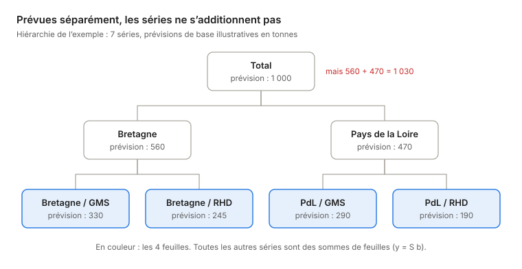
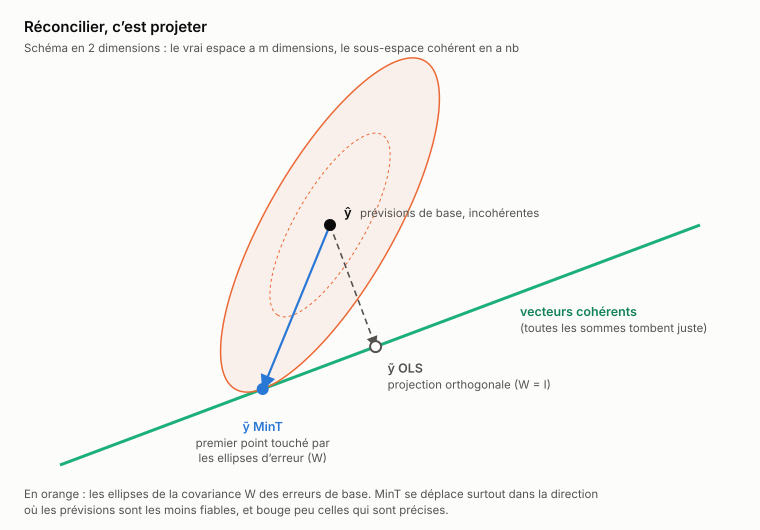
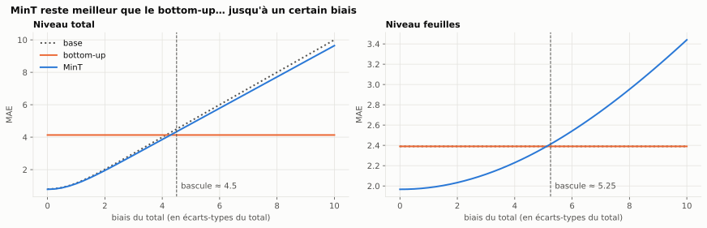
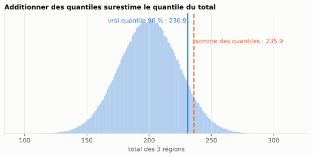
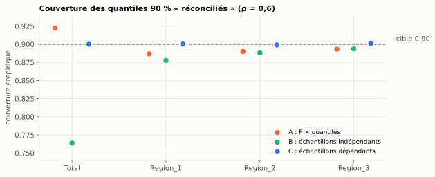
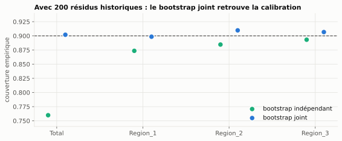
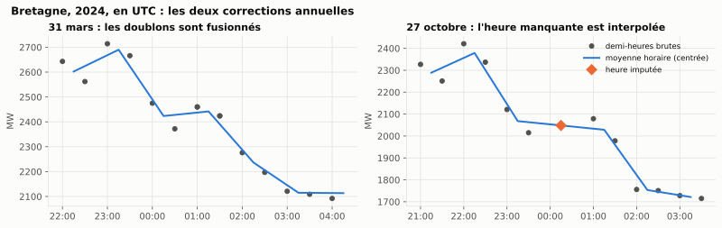
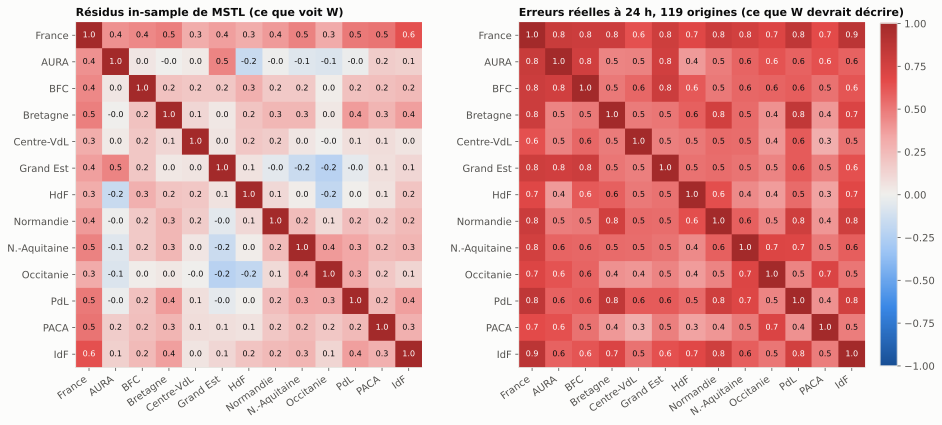




The national forecast doesn't match the sum of the regional forecasts. Every month, someone
has to decide which number wins. Hierarchical reconciliation promises to remove that
arbitration. It keeps that promise… and only that one.


*Reading time: about 22 minutes. Every formula is followed by its intuition, so you can skim the
maths without losing the thread. The figures come from the original notebooks and are labelled in
French.*



This article distils my **active research for week 37** (September 2026). I didn't just read: I
checked the sources, rewrote MinT from scratch, ran controlled experiments, reconciled the
electricity demand forecasts of France's 12 mainland regions, and tested a Bayesian
reconciliation package. Everything is reproducible, with pinned versions, in the
[W37_hierarchical_reconciliation](https://github.com/gwils28/W37_hierarchical_reconciliation)
repository.


**In short.** Reconciliation guarantees **coherence**, not accuracy, and not calibration. I found
four pieces of evidence:

1. **In theory**: a bias in a single forecast contaminates all the others.
2. **Probabilistically**: an interval advertised as 90 % at the total level can cover only **76 %**.
3. **On real data**: over 119 days of 2024, the simplest method (bottom-up) **beats** MinT.
4. **On retail sales**: **98 %** of the intervals reconciled by MinT start below zero.


## 1. The problem: forecasts that don't add up

Take a cooperative that sells in two French regions, each through two channels: supermarkets
(GMS) and food service (RHD). That's 7 series to forecast: the total, 2 regions and 4 region ×
channel pairs. Each series has its own model, tuned as well as possible. But nobody asked the
models to agree with each other.



The structure is described by a **summing matrix** \(S\). The bottom series, the **leaves**
\(b_t\), determine everything else:

$$
y_t = S\,b_t, \qquad
S = \begin{pmatrix}
1 & 1 & 1 & 1\\
1 & 1 & 0 & 0\\
0 & 0 & 1 & 1\\
1 & 0 & 0 & 0\\
0 & 1 & 0 & 0\\
0 & 0 & 1 & 0\\
0 & 0 & 0 & 1
\end{pmatrix}
\begin{matrix}\leftarrow \text{total}\\ \leftarrow \text{Bretagne}\\ \leftarrow \text{Pays de la Loire}\\ \leftarrow \text{Bretagne / GMS}\\ \leftarrow \text{Bretagne / RHD}\\ \leftarrow \text{PdL / GMS}\\ \leftarrow \text{PdL / RHD}\end{matrix}
$$

A forecast vector is **coherent** if it can be written \(S\,b\) for some \(b\): every sum adds up.
Base forecasts \(\hat y\), produced series by series, almost never are.

The two classic answers throw information away:

- **bottom-up** sums the leaves and ignores the forecasts of the aggregates, which are often more
  stable;
- **top-down** splits the total using historical proportions and ignores what the leaf models
  know. If it computes those proportions on a history that includes the test period, it also
  leaks information from the future, and nothing in the metrics will flag it.

Optimal reconciliation sets out to use **all** the forecasts at once.

## 2. MinT in five minutes: reconciling is projecting

### The framework

We look for a matrix \(G\) that maps the \(m\) base forecasts to \(n_b\) leaves, which are then
summed back up:

$$
\tilde y = S\,G\,\hat y .
$$

Two conditions constrain the choice of \(G\):

| Condition | Formula | What it means |
|---|---|---|
| unbiasedness preservation | \(SGS = S\) | a vector that is already coherent is left unchanged |
| reconciled error variance | \(\operatorname{Var}(y - \tilde y) = S G W G^\top S^\top\) | with \(W = \operatorname{Var}(y - \hat y)\), the covariance of the base errors |

**MinT** (*Minimum Trace*, Wickramasuriya, Athanasopoulos and Hyndman, 2019) minimises the trace
of that variance subject to \(SGS = S\). The solution has a closed form:

$$
G = \left(S^\top W^{-1} S\right)^{-1} S^\top W^{-1}, \qquad P = S\,G .
$$

### The geometric intuition

\(P\) is a **projection** (\(P^2 = P\)). Coherent vectors form a subspace of dimension \(n_b\) in
\(\mathbb{R}^m\), and reconciling means bringing \(\hat y\) back onto that subspace. The whole
question is: **in which direction?**



- **OLS** (\(W = I\)) projects orthogonally: every series is treated as equally reliable.
- **MinT** projects according to \(W^{-1}\). It picks the coherent point that is most plausible
  given the shape of the errors: it moves badly forecast series a lot and the others very little.
- **Bottom-up** is a projection too, with \(G = [\,0 \mid I\,]\): it only moves the aggregates.

| Method | Matrix \(W\) used | What it assumes |
|---|---|---|
| bottom-up | — (\(G = [0 \mid I]\)) | the aggregates add nothing |
| OLS | \(I\) | all errors are alike |
| WLS struct | \(\operatorname{diag}(S\mathbf{1})\) | variance proportional to the number of aggregated leaves |
| WLS var | \(\operatorname{diag}(\hat W)\) | individual variances, no correlations |
| MinT shrink | \(\lambda D + (1 - \lambda)\hat W\) | variances **and** correlations, regularised |

### The detail that will matter later

\(W\) is unknown. In practice it is estimated on the **in-sample residuals** of the base models,
then regularised with Schäfer–Strimmer *shrinkage*: correlations are pulled towards zero with an
intensity \(\lambda \in [0, 1]\) estimated from the data. Keep this in mind: **it's what makes
MinT lose on real data** (section 6).

## 3. What the 2026 literature says

I read six papers, chosen to cover MinT's blind spots. For each one, I checked what was claimed
about it against its official abstract. The reading plan sometimes oversold them.


| Paper | What it brings | What the check corrected |
|---|---|---|
| Li, Chen, Taylor, Mao — *A Forecast Combination Framework for Hierarchical and Grouped Time Series Reconciliation* ([2608.13886](https://arxiv.org/abs/2608.13886)) | The optimal combination weights **exactly recover MinT**. Forty years of forecast-combination literature (shrinkage, penalties, positivity) become reusable. | — |
| Rønlev-Knudsen, Madsen, Møller — *Online forecast reconciliation using linear models* ([2606.23326](https://arxiv.org/abs/2606.23326)) | Reconciliation as a regularised regression, **updated recursively**: no need to re-estimate \(W\) at every run. | The case study is a **temporal** hierarchy, not a geographical one. Validate before transposing. |
| Nugteren, Abolghasemi, Mengersen, Drovandi — *Hierarchical Bayes meets hierarchical forecasting* ([2606.23009](https://arxiv.org/abs/2606.23009)) | A Bayesian model that **targets the level where the decision is made**. | Coherence is **soft** (penalised), not exact. |
| Wang, Johnson, Klee, Malloy — *Billions-Scale Forecast Reconciliation* ([2602.05030](https://arxiv.org/abs/2602.05030)) | Reconciliation over more than **four billion** values; least squares and share-based allocation coincide under conditions. | — |
| Panagiotelis, Gamakumara, Athanasopoulos, Hyndman — *Probabilistic forecast reconciliation* ([EJOR, 2023](https://robjhyndman.com/publications/coherentprob/)) | The proper definition of reconciling a **distribution**, evaluated with the energy score and the variogram score. | — |
| Biswas, Zambon, Nespoli, Corani — *Nonlinear Probabilistic Forecast Reconciliation* ([2604.26668](https://arxiv.org/abs/2604.26668)) | What happens when \(y = Sb\) no longer holds: logs, ratios, average prices. | — |

*The check was limited to abstracts and official pages, not the full PDFs.*

Three trends stand out:

1. **Reconciliation is becoming an estimator, not a post-processing step.** Seen as forecast
   combination or as regularised regression, it can be regularised, tested and defended in an
   architecture review.
2. **The scale objections are gone.** Four billion values on one side, recursive estimation on
   the other.
3. **The open front is probabilistic and nonlinear reconciliation.** That is exactly where
   point-forecast MinT has nothing left to say. Section 5 shows it.

## 4. Rewriting MinT yourself

Calling `MinTrace(method="mint_shrink")` takes one line. But until you have written the formula
yourself, you can't explain a strange result. So I reimplemented MinT shrink in NumPy, and I
didn't allow myself to read the [HierarchicalForecast](https://github.com/Nixtla/hierarchicalforecast)
code until mine was frozen. Here is the core, condensed:

```python
import numpy as np

def mint_shrink(E, S):
    """E: in-sample residuals (T × m), S: summing matrix (m × nb). Returns P = SG."""
    T, m = E.shape
    W1 = E.T @ E / T                          # sample covariance
    Z = E / np.sqrt(np.diag(W1))              # standardised residuals
    R = Z.T @ Z / T                           # correlations
    w = Z[:, :, None] * Z[:, None, :]         # T × m × m: naive, see below
    var_r = T / (T - 1) ** 3 * ((w - R) ** 2).sum(axis=0)
    off = ~np.eye(m, dtype=bool)
    lam = np.clip(var_r[off].sum() / (R[off] ** 2).sum(), 0, 1)   # Schäfer–Strimmer λ
    W = lam * np.diag(np.diag(W1)) + (1 - lam) * W1
    WiS = np.linalg.solve(W, S)                       # W⁻¹S, without inverting W
    G = np.linalg.solve(S.T @ WiS, WiS.T)             # (S'W⁻¹S)⁻¹ S'W⁻¹
    return S @ G
```

On a synthetic hierarchy (2 regions × 2 channels, 80 quarters, `AutoETS` models), the checks
pass:

| Check | Threshold | Measured |
|---|---|---|
| \(P^2 = P\) and \(SGS = S\) | < 1e-12 | 2.2e-16 |
| incoherence of the reconciled forecasts | machine precision | 5.7e-14 |
| relative gap to HierarchicalForecast 1.5.1 | < 1e-3 | **1.07e-5** |
| **non-zero** gap | > 0 | yes |

The last check is deliberate: an exactly zero gap would have meant I had copied their code. That
small residual gap taught me three things.

### Lesson 1: one method name covers several estimators

The research plan put the gap down to a difference in how \(\lambda\) is computed. That's wrong:
the two \(\lambda\) values agree to within 2e-5. **About 99.8 % of the gap comes from the base
covariance.** The library centres the residuals and divides by \(T - 1\) (`np.cov`), whereas my
version uses \(E^\top E / T\). With the same convention, the gap drops to 3e-6.

The practical consequence: `mint_shrink` covers at least three implementation choices (centring,
`ddof`, the \(\lambda\) variant) that change the published number. If two teams compare their runs,
they need to **pin the version and document the estimator**.

### Lesson 2: shrinkage is a condition for existence

Even with 72 observations for 6 series, the sample covariance is ill-conditioned (condition
number ≈ 3·10⁴). An aggregate's residual is almost the sum of its leaves' residuals, so the
columns of \(E\) are nearly collinear. Shrinkage brings the condition number down to ≈ 23.

With more series than observations (\(m > T\)), it gets worse: \(\hat W\) has rank \(T\), so it is
singular. With \(T = 4\) and \(m = 6\), its condition number reaches 1.7·10¹⁷. Shrinkage then
picks \(\lambda = 0.907\) on its own and brings the condition number down to 10. **Shrinkage is not
a convenience: without it, MinT doesn't exist on a real catalogue.** 40,000 products over three
years of weekly history means \(m/T \approx 250\).

### Lesson 3: the wall is also a memory wall

The line marked "naive" builds a \(T \times m \times m\) tensor: **31 GB for 5,000 series.** My
first version got the Jupyter kernel killed by the operating system. Yet \(\lambda\) only depends
on off-diagonal sums, which can be computed from the \(T \times T\) Gram matrix. Memory goes from
\(O(T m^2)\) to \(O(T^2 + Tm)\), i.e. 0.6 GB, for a result identical to within 1e-10. Beyond that,
it's \(W\) itself that must no longer be formed. A diagonal plus a rank-\(T\) matrix can be
inverted with the Woodbury identity, without ever building an \(m \times m\) matrix.

## 5. Three places where MinT breaks

MinT is optimal **under assumptions**: unbiased base forecasts, known \(W\), linear constraints,
continuous quantities. I set up a controlled experiment for each of these assumptions. Each time,
I looked for the point where it gives way.

### 5.1 MinT spreads bias

The condition \(SGS = S\) **preserves** unbiasedness; it doesn't **create** it. The
counter-example fits in four series: one total and three leaves. The forecasts are exact
everywhere except for a +15 bias on the total. \(W\) trusts the total 9 times more than each leaf.

| Series | Truth | Base | Bottom-up | MinT | MinT error |
|---|---|---|---|---|---|
| Total | 60 | 75 | 60 | 74.46 | 14.46 |
| Leaf 1 | 10 | 10 | 10 | 14.82 | **4.82** |
| Leaf 2 | 20 | 20 | 20 | 24.82 | **4.82** |
| Leaf 3 | 30 | 30 | 30 | 34.82 | **4.82** |

Bottom-up ignores the total and sees nothing. MinT, which trusts it, injects the bias into
**every** leaf. Because reconciliation is linear, the reconciled bias equals \(P \times\) the base
bias: it spreads along a column of \(P\).


It isn't all or nothing: there is a **threshold**. In simulation (20,000 draws), MinT stays ahead of
bottom-up as long as the bias on the total is below ≈ 4.5. Above that, it becomes worse at the
total; above ≈ 5.25, it is **also worse at the leaves**, i.e. at every level.




**The reflex.** Test the mean of the residuals **at each level**, then correct the base forecasts
**before** reconciling. Never adjust a reconciled forecast afterwards: changing a single series
breaks coherence.


### 5.2 MinT reconciles means, not quantiles

This is the heart of the week. An inventory manager doesn't decide on a mean. They decide on a
**quantile**: the stock that covers demand 90 % of the time. And the quantile of a sum is not the
sum of the quantiles.



Consequence: **no vector of quantiles is coherent**. Coherence is a property of the **joint**
distribution, not of the marginals.

The experiment is fully simulated, so the truth is known: one total and three Gaussian regions,
correlated at \(\rho = 0.6\) (the weather moves them together). Each base model is **perfect** on
its own series. The means are already coherent, so everything we observe is a pure "quantile"
effect. We compare three ways of getting reconciled 90 % quantiles:

- **A.** Apply \(P\) directly to the quantiles. This is the most common mistake.
- **B.** Draw samples from each series **independently**, project each sample, then read off the
  quantiles.
- **C.** The same, but with **joint** samples that respect the dependence between series.

| Series | Coverage A | Coverage B | Coverage C |
|---|---|---|---|
| Total | 0.922 | **0.764** | **0.900** |
| Region 1 | 0.887 | 0.878 | 0.900 |
| Region 2 | 0.890 | 0.888 | 0.899 |
| Region 3 | 0.893 | 0.894 | 0.901 |

*Target: 0.900. 400,000 draws, fixed seed.*



How to read this table:

1. **A is wrong in both directions at once.** It over-covers at the total and under-covers in the
   regions. No global factor can fix it. The resulting vector adds up perfectly, but it isn't the
   quantile of anything.
2. **B, which looks rigorous, is the worst**: 76 % coverage at the total for 90 % advertised.
   Projecting samples is the right mechanism. But independent draws erase the dependence, and the
   variance of the sum is massively underestimated.
3. **C is calibrated everywhere.** Its only difference from B is the dependence structure.

Sweeping the correlation makes the result hard to dispute:

 becomes less and less visible and the sophisticated error (B) becomes more and more costly.")

| \(\rho\) | Gap "sum of q90s" / "q90 of the sum" | Coverage B at the total |
|---|---|---|
| 0.0 | +6.6 % | 0.816 |
| 0.3 | +4.2 % | 0.787 |
| 0.6 | +2.2 % | 0.764 |
| 0.9 | +0.5 % | **0.746** |


**The counter-intuitive fact.** The two errors move in opposite directions. The more correlated
the series, **the less visible the naive error, and the more costly the sophisticated one**. That
is exactly the regime of energy (the weather) and retail (promotions).


In practice, the true covariance is unknown. The solution is a **joint bootstrap** of the in-sample
residuals: we resample **time points**, and all series are drawn at the same time point. This gets
back to 0.902 at the total. A series-by-series bootstrap reproduces B's error (0.760). In
HierarchicalForecast, these are the `Bootstrap` and `PERMBU` methods.



A simple rule follows: **same time point, all series.** A bootstrap that draws residuals at
different dates for different series (histories of unequal length, gaps) is method B in disguise.

### 5.3 MinT doesn't know about zero

The third implicit assumption: quantities are continuous and symmetric. On slow-moving product
sales (often 0, sometimes a spike), a Gaussian with the right variance spills well below zero.


I measured it on one store from the M5 dataset (Walmart, store CA_1: 3,049 products and 11
aggregates, one-day-ahead forecast), comparing Gaussian MinT with
[BayesReconPy](https://github.com/supsi-dacd-isaac/BayesReconPy). This package doesn't
**project**: it **conditions**. It keeps the joint distribution of the products on the
non-negative integers and reweights it by what the aggregate forecasts say (Bayes' rule).

| | Gaussian MinT | bottom-up | MixCond | **TD-cond** |
|---|---|---|---|---|
| products with a negative mean | **11** | 0 | 0 | 0 |
| products whose 90 % lower bound is < 0 | **2,992 (98 %)** | 0 | 0 | 0 |
| product RPS (lower = better) | 0.819 | 0.676 | 0.674 | **0.669** |
| aggregate MIS (lower = better) | 1,825 | 2,330 | 2,312 | **444** |

The number that matters depends on the decision. For a decision based on the mean, 0.36 % of the
forecasts are negative. For a service level, it's 98 %. The mechanism is easy to read: with a
diagonal \(W\), each product's adjustment is proportional to its variance. The "almost always 0,
sometimes a big spike" products therefore absorb most of the correction and go below zero.


Two more observations:

- **Bottom-up and MixCond make the aggregate intervals five times worse.** Assuming 3,049
  independent products gives a total that is far too narrow: it's method B from the previous
  section, at scale. **TD-cond**, which starts from the aggregates, avoids that trap and stays the
  most accurate at both levels.
- My numbers **reproduce the official R vignette** of the `bayesRecon` package on the same store,
  with a median gap of 0.15 skill-score points.


**Check a package before recommending it.** At the time of testing, BayesReconPy 0.5.0 no longer
installed as is: the release of PuLP 4 breaks an import (you need `pulp<4`). Its licence is
contradictory: MIT in the metadata, LGPL-3.0 in the repository. Finally, `reconc_td_cond` modifies
its inputs in place. It's an excellent specialised tool, but you need to know its conditions of
use.


## 6. On real data: twelve regions, one France

The previous experiments are controlled. The next step was to confront MinT with real data. I
used the **electricity demand of France's 12 mainland regions** (éCO2mix, RTE, via
[ODRÉ](https://odre.opendatasoft.com/explore/dataset/eco2mix-regional-cons-def/information/),
Licence Ouverte v2.0). The business goal: deliver hourly day-ahead forecasts where **the sum of the
regions exactly matches the national total**.

### Check the data before forecasting

Three findings came before the first forecast:

- **Nouvelle-Aquitaine stops at the end of 2024**, while the other regions continue. Since 2025,
  the sum of the regions is no longer the national total. The protocol is therefore limited to
  2013–2024.
- **The source has a daylight-saving defect**, every year and in every region: two duplicates at
  the end of March, one missing hour at the end of October. A missing row distorts a total
  **without raising any error**, which is more dangerous than a `NaN`.
- **The official total isn't always the sum of the regions.** The gap exceeds 200 MW in October
  2016. A year-by-year test shows it stays below 6 MW (rounding) from 2014 to 2024, except 2016:
  over the period actually used, reconciling towards that total makes sense.



### The protocol, fixed before seeing the results

- **Hourly step**: mean of the half-hours, in UTC. MW stay MW, and no day has 23 or 25 hours.
- **Base models**: `SeasonalNaive(168)` as the floor, `MSTL` with double seasonality (24 h and
  168 h) as the reconciled model.
- **Window**: rolling 52 weeks, **strictly prior** to each origin.
- **Methods compared**: bottom-up, OLS, WLS struct, WLS var, MinT shrink.
- **Metric**: MASE **per level** (France, then the average over regions), never a global average.

The original plan called for 4 origins: four Tuesdays in November 2024. I added a robustness study
over **119 origins**, one every three days across 2024.

### The ranking flips

Coherence is guaranteed: the maximum incoherence is exactly 0 MW after reconciliation, versus
672 MW for the base forecasts. But accuracy tells a different story depending on the number of
origins:


type: 'bar',
data: {
  labels: ['Regions (decision level)', 'France'],
  datasets: [
    { label: '4 Tuesdays in November 2024', data: [-2.25, 0.81],
      backgroundColor: css(modeSombre ? '--color-neutral-500' : '--color-neutral-300'),
      borderColor: css(modeSombre ? '--color-neutral-400' : '--color-neutral-500') },
    { label: '119 origins across 2024', data: [2.25, 5.31],
      backgroundColor: css(modeSombre ? '--color-primary-400' : '--color-primary-600'),
      borderColor: css(modeSombre ? '--color-primary-300' : '--color-primary-700') }
  ]
},
options: {
  plugins: {
    title: { display: true, text: 'MinT shrink versus bottom-up: change in MASE (%)' },
    subtitle: { display: true, text: 'Above zero, MinT does worse than simply summing the regions' }
  },
  scales: { y: { title: { display: true, text: 'Change in MASE (%)' } } }
}


| Mean MASE, 119 origins | France | Regions |
|---|---|---|
| SeasonalNaive (floor) | 0.947 | 0.939 |
| **bottom-up** | **0.352** | **0.427** |
| WLS var | 0.356 | 0.430 |
| WLS struct | 0.358 | 0.432 |
| OLS | 0.366 | 0.439 |
| MinT shrink | 0.370 | 0.439 |

Over 4 origins, MinT seemed to win at the regional level (−2.2 %), without significance. Over 119
origins, **bottom-up is the best method at both levels**, and MinT shrink does worse than it **on
all 13 series**, without exception. The four Tuesdays had landed on the favourable side of a very
wide distribution. After Holm correction, the evidence is moderate (p ≈ 0.05), but the sign is
consistent. Four origins are not enough to rank methods.

### The cause: a hidden assumption in `mint_shrink`

MinT assumes that the estimated covariance \(W\) resembles that of the **true forecast errors**. I
tested that assumption directly. MSTL's in-sample residuals are smoothing leftovers, correlated
at **0.11** on average between regions. The true out-of-sample errors are correlated at **0.56**
(bootstrap interval [0.45; 0.65]). MinT is therefore reconciling with the wrong map of the errors.



To isolate the cause, I ran a controlled experiment. Everything stays the same except \(W\), which
I estimate on the **out-of-sample errors of past origins**, so still without leakage.

| 99 origins | Regional MASE vs bottom-up | p (Wilcoxon) |
|---|---|---|
| MinT shrink, in-sample \(W\) | **+2.6 %** | 0.017 |
| MinT, \(W\) estimated on past errors | **−0.1 %** | 0.83 |


Fixing \(W\) **removes the handicap**, but doesn't make MinT win. That's plausible: regional errors
are strongly correlated and share the same sign (a cold snap hits everyone), so there is no
cross-sectional information to exploit.

**My recommendation for this case:**

1. **Ship bottom-up.** It meets the goal (exact coherence), it's the most accurate here, and it
   can be explained in one sentence: "the national figure is the sum of the regions".
2. **Don't use `mint_shrink` with the in-sample residuals of a smoothing model.** If MinT is
   needed, estimate \(W\) on rolling backtest errors.
3. **Invest in the base models** (temperature, public holidays). The largest errors are shared by
   all regions, and no reconciliation can recover them.

## 7. In production: where does reconciliation live?

One last question, about architecture: should reconciliation be a batch job, a step inside the
API, an SQL view or an estimator updated online? I chose a **materialised batch job with a
blocking quality gate**. The reasons fit in one diagram:


flowchart TD
    H[History and covariates] --> B["1. Base forecasts<br/>one model per series → incoherent ŷ"]
    B -->|ŷ + training residuals| R["2. Reconciliation<br/>P = S(S'W⁻¹S)⁻¹S'W⁻¹"]
    S["Versioned S + fingerprint"] --> R
    R --> Q(["3. Quality gate<br/>coherence · negatives · MASE per level"])
    Q -->|fail| X[Publication blocked + alert]
    Q -->|pass| T[("forecast_reconciled table<br/>immutable artefact: run_id, S fingerprint, W version")]
    T --> A["API /forecast?level=<br/>read-only"]


**The non-negotiable point: the API never reconciles on the fly.** Otherwise two simultaneous
calls on two levels can return numbers that don't add up, which is exactly the problem we set out
to remove. **Coherence is a property of the artefact, not of the request.**

| Option | For | Against | |
|---|---|---|---|
| Materialised batch | coherent by construction, auditable | refresh latency | ✅ chosen |
| On the fly in the API | always up to date | coherence not guaranteed across calls | ❌ |
| SQL view | zero infrastructure | MinT in SQL is unmanageable, you end up with bottom-up in disguise | ❌ |
| Recursive online estimation | \(W\) tracks regime changes | mutable state to version and replay | ⏳ later |

Writing this contract as executable code, with tests where each rule **fails**, corrected four
things in the paper version:

- **Fallback to a simpler method must not trigger when \(m > T\).** That is precisely the case
  shrinkage exists for (lesson 2). It triggers on the **measured** condition number of \(W\).
- **An absolute coherence tolerance doesn't mean the same thing at 10 MW and at 50 GW.** I added a
  relative tolerance.
- **The "no MASE degradation" rule applies level by level**, never on average. Otherwise a gain at
  the national level hides a loss at the decision level.
- **The fingerprint of \(S\) also covers the labels.** A renamed leaf changes the hierarchy without
  changing the matrix.

```yaml
reconciler:
  method: mint_shrink
  fallback: wls_struct          # triggered by measured cond(W), not by m > T
  covariance_window: 104        # weeks, strictly prior to the origin
quality_gate:
  coherence_tol_abs: 1e-6
  coherence_tol_rel: 1e-9       # floating-point noise grows with the values
  max_negative_share: 0.001     # Gaussian MinT on M5: 0.0036 → blocked
  compare_to_baseline: bottom_up  # fail if MASE degrades by more than 2 % at ANY level
  fail_action: block_publish
```

## 8. What I take away

1. **Reconciliation sells coherence, not accuracy.** Accuracy gains are frequent, never
   guaranteed, and they depend on assumptions you can test.
2. **Always compare with bottom-up, level by level.** Beating incoherent forecasts proves
   nothing, and a global average hides the level where the decision is made.
3. **\(W\) is the weak link.** Estimated on in-sample residuals, it can describe errors that don't
   exist. Shrinkage is essential, but it doesn't fix a bad source.
4. **Never reconcile quantiles.** Reconciling a distribution means projecting **joint** samples.
   Independent draws give a 90 % interval that covers 76 %.
5. **Counts need different tools.** A Gaussian has no business near zero. Conditioning (TD-cond)
   is coherent, non-negative and more accurate, all at once.
6. **Check before you believe**: the data (daylight saving, a missing region), the sources (what
   the abstract actually says), the packages (installation, licence) and the rankings (4 origins
   versus 119).


**The comprehension test.** *"You reconcile with MinT. MASE improves at the national level but
degrades at the product level. What's going on?"* Three hypotheses, in order: a **biased** base
forecast (5.1), a **poorly estimated** \(W\) (section 6), a **leak** or an estimation window that
overlaps a regime change. And the real question is a business one: which level carries the
decision? If replenishment is decided per product, a national gain paid for at the product level
is a regression.


**What's next.** Everything above collapses if \(W\) is estimated on contaminated residuals, if the
hierarchy changes without notice, or if a leaf has a gap. So week 38's research is about
**building leak-free temporal features**: correct rolling windows, point-in-time data, reference
tables that change over time. The common thread: it's not the model that leaks, it's the join.

## Reproduce and go further

The code, the 14 notebooks and the 88 tests are in the
[gwils28/W37_hierarchical_reconciliation](https://github.com/gwils28/W37_hierarchical_reconciliation)
repository (Python 3.12, HierarchicalForecast 1.5.1, statsforecast 2.1.1, BayesReconPy 0.5.0,
versions locked with `uv`). Every number in this article comes from a `uv run w37 …` command. The
repository is in French.

**Sources**

- Wickramasuriya, Athanasopoulos, Hyndman, *Optimal forecast reconciliation for hierarchical and grouped time series through trace minimization*, JASA, 2019.
- Li, Chen, Taylor, Mao, [*A Forecast Combination Framework for Hierarchical and Grouped Time Series Reconciliation*](https://arxiv.org/abs/2608.13886), arXiv, 2026.
- Rønlev-Knudsen, Madsen, Møller, [*Online forecast reconciliation using linear models*](https://arxiv.org/abs/2606.23326), arXiv, 2026.
- Nugteren, Abolghasemi, Mengersen, Drovandi, [*Hierarchical Bayes meets hierarchical forecasting*](https://arxiv.org/abs/2606.23009), arXiv, 2026.
- Wang, Johnson, Klee, Malloy, [*Billions-Scale Forecast Reconciliation*](https://arxiv.org/abs/2602.05030), arXiv, 2026.
- Panagiotelis, Gamakumara, Athanasopoulos, Hyndman, [*Probabilistic forecast reconciliation: properties, evaluation and score optimisation*](https://robjhyndman.com/publications/coherentprob/), EJOR 306(2), 2023.
- Biswas, Zambon, Nespoli, Corani, [*Nonlinear Probabilistic Forecast Reconciliation*](https://arxiv.org/abs/2604.26668), arXiv, 2026.
- Schäfer, Strimmer, *A shrinkage approach to large-scale covariance matrix estimation*, SAGMB, 2005.
- Biswas *et al.*, [*BayesReconPy*](https://joss.theoj.org/papers/10.21105/joss.08336), JOSS 10(111), 2025.
- Living bibliography: [awesome-forecast-reconciliation](https://github.com/danigiro/awesome-forecast-reconciliation).
- Data: regional éCO2mix, Open Data Réseaux Énergies (ODRÉ), RTE, Licence Ouverte v2.0; [M5 Forecasting](https://www.kaggle.com/competitions/m5-forecasting-accuracy).
