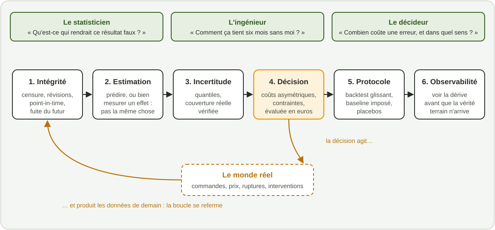


Mon métier n'est pas de produire des modèles. Il est de réduire l'incertitude sur laquelle des
gens engagent de l'argent, du temps et du risque, et de le faire d'une façon que d'autres
peuvent vérifier, contester et reprendre après moi.


*Temps de lecture : environ 20 minutes. Aucune formule : les termes techniques sont expliqués
la première fois qu'ils apparaissent.*



Cet été, j'ai rédigé pour moi-même deux documents de travail : une doctrine du data scientist
telle que je la conçois en 2026, et une définition du métier vers lequel je me spécialise, celui
de *Time Series Engineer*, l'ingénieur des séries temporelles. Ensemble, ils font plus de
quatre-vingts pages. Cet article en garde l'essentiel : ce que je crois, ce que je refuse, et la
façon dont je me mesure.


**Ce texte n'engage que moi.** Il ne décrit ni la politique d'un employeur, passé ou présent, ni
une norme de la profession. C'est une prise de position, écrite à charge : elle disqualifie
volontairement une partie de ce qui se pratique sous le nom de « data science ». On peut ne pas
être d'accord, et je serai content d'en discuter.



**En bref.** Ma vision du métier tient en sept convictions :

1. **La décision précède la donnée** : je ne commence rien sans savoir qui fera quoi différemment.
2. **La seule fonction de perte qui compte est métier**, et elle est presque toujours asymétrique.
3. **Corréler n'est pas décider** : dès qu'on agit sur une variable, il faut un raisonnement causal.
4. **Un modèle non déployé n'existe pas.**
5. **L'incertitude est un livrable**, pas une précaution oratoire.
6. **La simplicité est un choix d'ingénierie**, et chaque brique de complexité doit se mériter.
7. **Je suis locataire de mon poste, mais propriétaire de mes compétences.**


## 1. Pourquoi j'écris ça maintenant

Pendant longtemps, la valeur visible d'un data scientist était sa production : un pipeline de
features, un modèle de référence, un notebook d'exploration, un tableau de bord. Entre 2023 et
2026, cette production est devenue quasi gratuite : un assistant de codage bien piloté l'écrit en
quelques minutes. J'en ai décrit l'usage dans
[ma méthode de travail avec Claude Code](/posts/claude-code-data-science/).

La conséquence est simple à énoncer et difficile à digérer : **la production n'est plus le goulot
d'étranglement, le jugement l'est.** Quand l'artefact devient gratuit, ce qui vaut, c'est de
savoir quel artefact produire, à quelle question il répond, quelle décision il modifie et combien
vaut cette modification.

J'y vois quatre déplacements :

| Avant | Maintenant |
|---|---|
| Le modèle | La décision qu'il modifie |
| La prédiction | L'intervention : « que se passe-t-il si j'agis ? » |
| La précision un jour de test | La fiabilité pendant dix-huit mois |
| L'exécution | Le cadrage |

Le dernier est le plus sournois. Quand l'exécution est gratuite, une mauvaise question coûte plus
cher qu'avant : le système qui y répond est produit, déployé et adopté plus vite, avant que
quiconque ne voie l'erreur.

Je refuse aussi de définir le métier **par les outils** (« maîtrise Python, SQL, Spark » décrit un
environnement de travail, pas un professionnel), **par le titre** (data scientist, ML engineer, AI
engineer sont des cases d'organigramme redécoupées tous les deux ans) ou **par la nouveauté** (un
métier qui se redéfinit à chaque sortie de modèle est une mode). Je préfère me définir par les
problèmes que je sais clore.

## 2. Ce qui a perdu sa valeur, ce qui en a gagné

**Ce qui s'est effondré** : la syntaxe, le code de plomberie, le modèle de référence sur un
tableau propre, la documentation descriptive, l'exploration de première passe, la veille de
surface. Si l'essentiel de mes compétences se trouvait là, ma valeur aurait été divisée, pas rognée
à la marge.

**Ce qui a pris de la valeur**, c'est ce qu'aucun assistant ne fait à ma place :

- **le cadrage** : traduire un problème flou en une question traitable, avec une population, une
  fenêtre de temps, une métrique de succès et un critère d'arrêt ;
- **le jugement sur la validité** : savoir qu'un résultat est faux avant de savoir pourquoi. Un
  R² de 0,97 sur des données réelles est un aveu de fuite, pas une victoire ;
- **l'identification causale** : choisir un design et savoir quelles hypothèses il exige ;
- **l'architecture du système de décision** : où placer le modèle, qui tranche en cas de
  désaccord, ce qui se passe en mode dégradé, comment on l'éteint ;
- **la responsabilité** : signer, et dire « je réponds de ce chiffre ».

Entre les deux se trouve la zone la plus dangereuse : les tâches qui *semblent* automatisées. Un
assistant génère cent variables explicatives en trente secondes. Il ne sait pas que la date de
saisie d'un dossier est parfois renseignée *après* l'événement à prédire, à cause d'une correction
manuelle du service client. Il ne sait pas si une valeur aberrante est une erreur de saisie, un
événement rare ou le signal précurseur qu'on cherche.

Ma règle : **ce qui est automatisé, c'est la manipulation des symboles ; ce qui ne l'est pas,
c'est leur raccordement au monde.** Je me vois comme un professionnel du raccordement.

## 3. Trois métiers sous un seul titre, et où je me place

Le titre « data scientist » a longtemps recouvert trois professions aux critères de qualité
incompatibles :

| | Scientifique de la décision | Ingénieur ML | Ingénieur des systèmes d'IA |
|---|---|---|---|
| **Question type** | « Notre promotion a-t-elle créé de la valeur ? » | « Comment servir ce modèle de façon fiable et auditable ? » | « Comment automatiser ce traitement avec un taux d'erreur borné ? » |
| **Livrable** | Une décision documentée | Un système en production | Un système composite et son évaluation |
| **Erreur classique** | Être jugé au nombre de modèles déployés | Être recruté sur des énigmes statistiques | Confondre une démonstration et un système |

Je ne crois pas au professionnel qui ferait les trois au même niveau. Je vise une forme en **Π** :
une profondeur d'expert sur un axe, une compétence opérationnelle réelle sur un deuxième, et assez
de culture sur le troisième pour ne jamais me faire tromper. La barre transversale seule ne vaut
plus grand-chose : c'est exactement ce que les assistants fournissent gratuitement. La profondeur,
elle, est devenue la seule rente.

Ma jambe profonde, ce sont **les séries temporelles et l'inférence causale**. La deuxième, c'est
l'ingénierie : rendre un système reproductible, testé, observable. Ma barre transversale couvre la
vision par ordinateur, les modèles de langage et l'orchestration d'agents, que je pratique assez
pour en juger les promesses.

## 4. Sept convictions

Je les appelle des axiomes : une bonne pratique s'adapte au contexte, un axiome non.

### I. La décision précède la donnée

Je ne commence aucun travail sans réponses **écrites** à cinq questions (l'oral autorise
l'ambiguïté) :

1. **Quelle décision ?** Avec un verbe d'action : « décider quels clients contacter cette
   semaine », pas « mieux comprendre le churn ».
2. **Par qui ?** Un nom, pas un service.
3. **À quelle fréquence, avec quel délai ?**
4. **Que fait-on aujourd'hui sans modèle ?** Ce n'est jamais « rien » : c'est une règle, un
   expert, un tableur. Je le mesure avant de modéliser. Un modèle qui ne bat pas la règle
   existante ne vaut rien, quel que soit son score.
5. **Combien vaut une amélioration d'un point ?** Si personne ne le sait, le projet n'a pas de
   sponsor, seulement un demandeur.

Sans décision cible, la métrique de succès est choisie par défaut, par la personne qui en sait le
moins sur la valeur : le modélisateur. Le périmètre dérive, et la livraison n'a pas de
destinataire. Une exploration a sa place, si elle a un critère d'arrêt ; sans lui, ce n'est pas de
la recherche, c'est de l'occupation.

### II. La métrique métier est la seule fonction de perte qui compte

Les fonctions de perte usuelles sont symétriques ; le monde ne l'est jamais. En prévision de la
demande, sous-estimer coûte une rupture, surestimer coûte du stock immobilisé et de la démarque.
Optimiser une erreur symétrique dans ce contexte n'est pas une approximation, c'est une faute de
méthode.

Pour chaque projet, je construis une **table de traduction** : telle erreur statistique produit tel
effet opérationnel, qui vaut tant en euros. Elle n'a pas besoin d'être exacte ; elle doit être
explicite, partagée et contestée. Sa vraie fonction est de forcer le métier à révéler sa structure
de coûts, qui change presque toujours la conception du modèle. Et un indicateur que personne ne
relie à une action est mort : le supprimer est un livrable légitime.

### III. Corréler n'est pas décider

Beaucoup de demandes à forte valeur sont des demandes d'action déguisées en prédiction. « Prédis
qui répondra à la promotion » veut dire : *à qui l'envoyer pour gagner des ventes qui n'auraient
pas eu lieu sans elle ?* Un modèle prédictif cible les clients les plus susceptibles d'acheter,
c'est-à-dire ceux qui auraient acheté de toute façon : on subventionne des achats certains. Pour le
prix, c'est pire : dans l'historique, les prix montent quand la demande est forte, et un modèle
naïf « apprend » que les prix élevés font vendre.

Dès qu'une décision consiste à agir sur une variable, j'exige un **design d'identification** :
expérience randomisée si possible, quasi-expérience sinon (différence de différences, contrôle
synthétique), ajustement observationnel en dernier recours, hypothèses écrites. Je dessine le graphe
causal supposé et je le fais contester par le métier. Puis je fais passer des **tests placebo** :
appliquer la méthode à une fausse date d'intervention, ou à une unité jamais traitée. L'effet trouvé
doit être nul. Une estimation causale sans test de réfutation est une opinion chiffrée.

### IV. Un modèle non déployé n'existe pas

Un modèle remarquable qui dort dans un notebook vaut moins qu'une règle médiocre utilisée tous les
jours. Le notebook reste un excellent brouillon ; il n'est pas un livrable. Un travail abouti prend
l'une de ces quatre formes :

| Livrable | Comment je sais qu'il existe |
|---|---|
| Un système en production | Il tourne trois semaines sans son auteur |
| Une décision documentée | Le décideur a changé d'avis, ou confirmé son choix avec un argument nouveau |
| Un actif réutilisable | Une autre équipe l'utilise sans demander d'aide |
| Un refus argumenté | L'organisation a économisé un projet |

« Déployé » veut dire pour moi : qui tourne ailleurs que sur mon poste, se déclenche seul, vérifie
ses entrées, alerte quelqu'un en cas d'échec, mesure sa performance contre le réel, peut être
réentraîné par un autre, et peut être **éteint proprement**. Ce dernier point est le plus souvent
oublié : tout système doit avoir un plan de fin de vie.

D'où ma façon de démarrer : **le premier livrable est une chaîne de bout en bout, la plus bête
possible, en production.** Une moyenne mobile, une règle métier. Elle révèle tout de suite les vrais
obstacles (accès, formats, intégration), fixe le point de comparaison et produit de la valeur tôt.
L'ordre inverse, modéliser six mois puis chercher à déployer, est le chemin le plus sûr vers
l'abandon.

### V. L'incertitude est un livrable

Le problème dit du « vendeur de journaux » le formalise depuis plus d'un siècle : quand une rupture
coûte plus cher qu'un invendu, la bonne quantité à commander n'est pas la demande moyenne, mais un
**quantile** de la demande, fixé par le rapport entre les deux coûts. Livrer une prévision ponctuelle
à un planificateur, c'est l'obliger à reconstruire de tête une incertitude que j'avais dans mon
modèle et que j'ai jetée.

Je distingue le **bruit irréductible**, qui fixe le plafond de ce qu'on peut promettre, de la
**méconnaissance du modèle**, qui baisse avec plus de données. Les confondre conduit à promettre
des gains impossibles. Reste une troisième incertitude, que le modèle ne voit pas : celle d'être
simplement faux. Elle se traite en comparant des familles de modèles, en testant sur des périodes
de nature différente, et par honnêteté.

Une incertitude livrée doit aussi être **calibrée** : un intervalle annoncé à 90 % doit contenir la
réalité neuf fois sur dix. Dans [ma veille sur la réconciliation hiérarchique](/posts/reconciliation-hierarchique/),
un intervalle annoncé à 90 % n'en couvrait que 76 %. Un tel intervalle est plus dangereux qu'une
absence d'intervalle : il fabrique de la fausse sécurité.

### VI. La simplicité est un choix d'ingénierie, jamais un aveu

Je monte en complexité par étages, et chaque étage doit battre le précédent d'une marge fixée à
l'avance :

| Étage | En prévision |
|---|---|
| 0–1 | Dernière valeur, naïf saisonnier, moyenne mobile |
| 2 | Lissage exponentiel, ARIMA, Theta |
| 3 | Gradient boosting sur variables de calendrier et retards |
| 4 | Modèles globaux multi-séries, hiérarchie réconciliée |
| 5–6 | Réseaux profonds temporels, modèles de fondation |

Sur la plupart des séries d'entreprise, les étages 2 et 3 restent la zone de meilleur rendement.
Un modèle complexe se paie tous les mois (compréhension, audit, coût d'inférence, fragilité quand le
monde change) ; son gain, lui, est mesuré une fois, souvent avec optimisme.

Une pratique de diagnostic que j'aime bien : entraîner délibérément un modèle très flexible pour
estimer le plafond atteignable. Si l'écart avec un modèle simple est faible, le problème est limité
par le signal, pas par le modèle : il faut chercher des données, pas des architectures.

### VII. Locataire de mon poste, propriétaire de mes compétences

Un poste est un contexte temporaire ; une compétence est un actif qui se déprécie sans entretien.
La syntaxe et les API vieillissent en un ou deux ans, l'outillage en trois à cinq, l'architecture
en une dizaine. Les méthodes statistiques et causales tiennent des décennies, et le jugement
s'apprécie avec le temps. J'investis donc d'abord dans ces dernières, et je tiens la première au
niveau opérationnel, d'autant que les assistants en couvrent l'essentiel.

Si un poste ne me donne pas les problèmes qui exercent mon socle, je me les donne, et je mesure.

## 5. Ma spécialité : quand le temps entre dans les données

Il existe une classe de problèmes que l'on confie à des généralistes et qu'aucun généraliste ne
résout correctement : ceux où la variable qui compte est le temps.

### Le temps n'est pas une colonne

Une grande partie de l'outillage du machine learning suppose que les observations sont
interchangeables : on mélange, on découpe au hasard, on valide en croisé. Avec un axe temporel,
c'est faux, et la violation ne produit pas une petite dégradation : elle produit des résultats
excellents en laboratoire qui s'effondrent en production. Six choses changent à la fois :

- **l'ordre porte de l'information** : une validation croisée aléatoire laisse le modèle voir le
  futur ;
- **le futur n'existe pas encore** : la vérité terrain arrive après l'horizon, et pendant cette
  fenêtre aveugle on ne peut pas mesurer la performance réelle ;
- **le passé est révisé** : sans données *point-in-time*, telles qu'elles étaient connues à la date
  de décision, un backtest ment ;
- **l'observé n'est pas le réel** : une rupture de stock transforme une demande de 200 en une vente
  de 100. Les données sont *censurées* ;
- **la distribution bouge** : un modèle ne tombe pas en panne, il dérive en silence ;
- **le modèle influence ce qu'il prédit.**

Le dernier point mérite un exemple. Un modèle entraîné sur les ventes brutes prend les ruptures
pour un manque d'intérêt. Il sous-prévoit, donc on sous-commande, donc les ruptures augmentent, donc
les données sont encore plus biaisées. Le système se dégrade tout seul : c'est la spirale
descendante (*spiral-down*). Un simple drapeau de censure dans les données, gouverné et vérifié,
suffit souvent à l'éviter.

### Une chaîne à six maillons

Je ne livre pas un modèle, je livre une chaîne, et la faiblesse d'un seul maillon annule les cinq
autres :

Le métier est à l'intersection de trois cultures qui se parlent rarement. Le statisticien seul
produit des articles. L'ingénieur seul déploie consciencieusement des modèles biaisés. Le décideur
seul vend des tableaux de bord. C'est leur combinaison qui m'intéresse.

### La métrique ment plus souvent que le modèle

Chaque famille de problèmes a sa métrique piégée, qui récompense un comportement absurde :

| Problème | Métrique piégée | Ce qu'elle récompense |
|---|---|---|
| Demande intermittente (beaucoup de zéros) | Erreur absolue moyenne | La prévision « toujours zéro » |
| Valeurs proches de zéro | Erreur en pourcentage (MAPE) | Elle explose, et favorise la sous-prévision |
| Détection d'anomalies | F1 avec *point-adjustment* | Un détecteur quasi aléatoire passe pour l'état de l'art |
| Durée de vie résiduelle | Erreur quadratique sur les seules pannes | On jette les machines encore en vie, l'information la plus précieuse |
| Mesure d'impact | Qualité de l'ajustement | Un bon ajustement ne prouve aucune causalité |

Ma règle : **la métrique se choisit avant le modèle, se justifie par la décision qu'elle sert, et ne
quitte pas le laboratoire sans son contre-exemple connu.**

### Le protocole est le produit

Ce qui distingue à mes yeux un travail sérieux tient en quatre exigences :



On rejoue l'historique en avançant le point de départ de la prévision, en réentraînant à une cadence
définie. Jamais de validation croisée aléatoire, jamais un unique échantillon de test en fin de
période.


Le modèle doit battre une référence fixée avant de commencer. Et le simple gagne souvent : dans ma
veille sur la réconciliation, c'est la méthode la plus simple, le *bottom-up*, qui l'emportait sur
données réelles.


Placebos pour une mesure causale ; *ablation* pour une brique de complexité (la retirer et vérifier
que la performance chute) ; comparaison au « toujours zéro » pour l'intermittent.


Chaque métrique de tête est accompagnée de sa conversion : euros, points de taux de service, heures
de disponibilité. Une amélioration qui ne se traduit pas est une opinion.



Reste la dérive silencieuse. Pendant la fenêtre aveugle, aucune alarme ne se déclenche quand un
modèle devient faux ; seule la facture le signale, parfois des mois plus tard. Surveiller la seule
dérive des entrées produit beaucoup d'alertes et peu d'information. Je préfère n'alerter que si les
entrées dérivent *et* que la performance estimée chute. Et je refuse le réentraînement hebdomadaire
« par sécurité », sans validation : il propage en silence les problèmes des données récentes.

## 6. L'IA générative dans mon métier

Refuser les assistants serait une faute de productivité, pas une preuve de rigueur. Mais je les
utilise selon des règles strictes :

1. **Je ne délègue jamais la définition du problème**, ni **la validation** : tout résultat est
   vérifié par un chemin indépendant.
2. **Je délègue la production, jamais la compréhension.** Je ne commite pas de code que je ne
   saurais pas réécrire.
3. **Je traite l'assistant comme un stagiaire brillant**, rapide, sûr de lui et parfois
   complètement à côté. Cette image fixe le niveau de supervision.

L'assistant amplifie ce qu'on lui donne : sur une base de code propre, il accélère ; sur une base
sale, il aggrave. C'est pourquoi l'ingénierie logicielle (tests, structure, revue) est devenue à
mes yeux le vrai séparateur entre les profils.

Pour les systèmes construits *avec* des modèles de langage, trois convictions :

- **L'évaluation est le cœur du travail.** Un prompt se réécrit en dix minutes ; un jeu
  d'évaluation représentatif se construit en semaines, et c'est lui l'actif durable.
- **Le déterminisme d'abord.** Ce qui peut être une fonction ou une règle doit l'être, car l'erreur
  se compose : dix étapes fiables à 95 % donnent une chaîne fiable à environ 60 %.
- **En prévision, l'agent enveloppe le modèle numérique, il ne le remplace pas.** Le modèle produit
  le chiffre ; la couche de langage apporte du contexte daté, propose une révision bornée et
  l'explique en citant ses sources. Pour prouver que ce contexte apporte du signal, on le remplace
  par du texte mélangé : si le « gain » persiste, il était illusoire.

## 7. Ce que je refuse

Je me définis autant par ce que je refuse que par ce que je produis. Mais un refus sans alternative
est un abandon :

| Je refuse | Ce que je propose à la place |
|---|---|
| Un projet sans décision cible | Une demi-journée de cadrage |
| « Faites-nous de l'IA » | Trois cas d'usage chiffrés, et en choisir un |
| Un modèle sans point de comparaison mesuré | Mesurer d'abord la pratique actuelle |
| Une conclusion causale sans design | Un design expérimental, ou un avertissement en tête de document |
| Un modèle de demande entraîné sur les ventes brutes | Un drapeau de censure et une reconstruction de la demande |
| Une brique complexe sans ablation | L'ablation, documentée et rejouée dans le temps |
| Retirer les intervalles « pour simplifier » | Simplifier la représentation, pas l'information |
| Changer de méthode pour obtenir le résultat attendu | Rien. C'est une ligne rouge |

Dans la pratique, je dis rarement « non » sec. Je dis : « oui, et voici ce que cela déplace ».
Cela ajoute trois semaines : voulez-vous cet arbitrage, ou livrer d'abord ? La décision revient à
celui qui a le mandat de la prendre. Pour la même raison, je ne m'engage jamais sur une performance
avant d'avoir vu les données. Je m'engage sur un protocole honnête, une date de verdict et un
critère d'arrêt fixé à l'avance. C'est ce qui distingue, à mes yeux, un professionnel d'un vendeur.

## 8. Comment je me mesure

Une compétence qu'on ne prouve pas ne s'évalue pas. Je m'impose donc quelques garde-fous contre ma
propre complaisance.

**Le test du tiroir.** Que se passe-t-il si l'on ferme mon ordinateur pendant un mois ? Si tout
s'arrête, je *suis* le système : je n'ai rien construit, j'opère. Si tout continue sans progresser,
j'ai construit un système, pas une équipe. Si quelqu'un a amélioré mon travail sans me demander,
j'ai construit un actif. Je vise le troisième cas.

**Des preuves, pas des intentions.** Je tiens un portefeuille de preuves pour m'évaluer, pas pour
chercher un emploi. La plus forte est un système en production avec ses chiffres avant et après,
validés par le métier ; viennent ensuite un post-mortem d'incident, un refus documenté qui a évité
un projet, un actif réutilisé par d'autres. Chaque preuve tient sur une page, avec une section
obligatoire : **ce qui a raté.** Un portefeuille sans échec est soit incomplet, soit malhonnête.

**Une notation qui peut donner de mauvaises notes.** Pour mon travail personnel, j'utilise une
échelle de 0 à 3, plafonnée par la preuve : une séance sans artefact vérifiable (un commit, un test
qui passe, un backtest chiffré) vaut 0, quel que soit le temps passé. Une moyenne durablement
au-dessus de 2,5 ne signale pas l'excellence, mais des tâches choisies trop faciles.

**La veille active.** Lire et suivre des conférences produit une illusion de progrès : on reconnaît
les termes sans savoir faire. Je vise une heure de lecture pour quatre de pratique, et toute lecture
importante se termine par une implémentation. C'est le principe des articles de veille de ce blog :
je réécris, je teste, et je publie ce qui tient, y compris quand cela contredit la source. Une
veille utile conclut souvent : « ceci ne change pas ma pratique, et voici pourquoi ».

Enfin, trois principes empruntés à l'artisanat : **je signe** ce que je produis, avec une date et
une version ; **je documente les défauts** au lieu de les cacher ; et **je transmets**, parce qu'un
savoir-faire qui n'est pas transmis meurt avec le poste.

## 9. Les huit questions que je pose en premier

Pour finir sur du concret : voici ce que je demande à la première réunion sur un problème de
prévision. Vingt minutes, aucun accès aux données, et souvent plus d'information qu'un audit de
plusieurs jours.

1. **Quelle décision votre prévision alimente-t-elle, et à quelle cadence ?**
2. **Combien vous coûte une erreur vers le haut, comparée à une erreur vers le bas ?** Si ce
   rapport n'a jamais été formalisé, le système optimise forcément la mauvaise cible.
3. **Quelle est votre métrique de tête, et que battez-vous avec ?**
4. **Vos zéros sont-ils de vrais zéros ?** Rupture, capteur muet, machine encore en vie : dix
   secondes, et parfois tout le projet change.
5. **Quand vous rejouez l'historique, utilisez-vous les données telles qu'elles étaient connues à
   l'époque ?** Sinon, les backtests présentés ne prouvent rien.
6. **Votre intervalle à 90 % couvre-t-il vraiment 90 % ? Qui l'a vérifié ?**
7. **Comment sauriez-vous que votre modèle s'est dégradé, et en combien de temps ?**
8. **Quel modèle simple votre modèle actuel bat-il, et de combien ?** Très souvent, personne n'a
   comparé.

## Conclusion

Les outils cités ici seront dépassés dans quelques années, et le titre du métier aura peut-être
encore bougé. Ce qui ne bougera pas : la variabilité d'échantillonnage, l'asymétrie des coûts,
l'impossibilité d'inférer une causalité sans hypothèse, le fait qu'un système que personne n'utilise
ne produit rien, et le fait qu'une organisation fait confiance à des personnes, pas à des modèles.

Le data scientist « parfait » n'existe pas. Je ne décris pas ici un état atteint, mais une
direction. La question utile n'est pas « suis-je à la hauteur de ce texte ? », mais « dans quelle
direction dois-je bouger, et quelle est la preuve que j'ai bougé ? ».

Mon métier est de réduire l'incertitude sur laquelle d'autres engagent de l'argent, du temps et du
risque, et de le faire de façon vérifiable. Tout le reste est de l'outillage.

---

**Pour aller plus loin**

Les textes qui fondent la plupart de ces convictions sont anciens, et c'est ce qui les rend utiles :
ils décrivent des propriétés que dix ans de nouvelles architectures n'ont pas abolies.

- Hyndman & Koehler (2006), [*Another look at measures of forecast accuracy*](https://doi.org/10.1016/j.ijforecast.2006.03.001) :
  pourquoi le MAPE trompe, et le MASE comme alternative.
- Gneiting & Raftery (2007), [*Strictly Proper Scoring Rules, Prediction, and Estimation*](https://doi.org/10.1198/016214506000001437) :
  pourquoi certaines métriques incitent à annoncer la vraie distribution.
- Brodersen et al. (2015), [*Inferring causal impact using Bayesian structural time-series models*](https://doi.org/10.1214/14-AOAS788) :
  le contrefactuel en séries temporelles, et l'hypothèse dont tout dépend.
- Sculley et al. (2015), [*Hidden Technical Debt in Machine Learning Systems*](https://papers.nips.cc/paper/5656-hidden-technical-debt-in-machine-learning-systems) :
  boucles de rétroaction cachées, dépendances de données, dérive.
- Elmachtoub & Grigas (2022), [*Smart "Predict, then Optimize"*](https://doi.org/10.1287/mnsc.2020.3922) :
  pourquoi une prévision précise ne fait pas forcément une bonne décision.
- Wu & Keogh (2023), [*Current Time Series Anomaly Detection Benchmarks are Flawed and are Creating the Illusion of Progress*](https://doi.org/10.1109/TKDE.2021.3112126) :
  quand l'évaluation fabrique du progrès.
- Tan et al. (2024), [*Are Language Models Actually Useful for Time Series Forecasting?*](https://arxiv.org/abs/2406.16964) :
  le contrepoint à l'emballement, par l'ablation.
