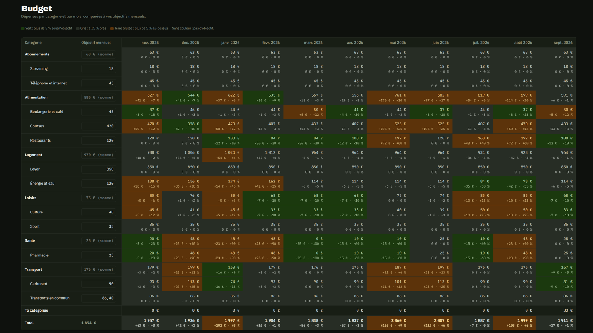


Savoir où part l'argent du foyer, mois après mois, et ce que vaut son patrimoine, sans confier
ses relevés bancaires à un service en ligne. Tout tourne sur une machine de la maison.





chacune bloquée tant que la CI n'est pas verte
dont 25 tests de propriété sur les invariants financiers
écrites, avec les alternatives rejetées





**Projet en cours.** Cette fiche décrit l'état du dépôt au 8 octobre 2026. Les chiffres
ci-dessus sont comptés dans le code, et seront mis à jour à chaque phase livrée.


## Le problème

Les applications de budget grand public demandent presque toutes la même chose : un accès à vos
comptes bancaires, et l'hébergement de votre historique financier sur leurs serveurs. Les
tableurs, eux, ne demandent rien, mais s'abandonnent au bout de trois mois : ressaisir, recopier
et catégoriser à la main coûte trop cher.

Je voulais un outil entre les deux :

- **privé par construction** : les données restent sur une machine du foyer, sans télémétrie ni
  service tiers ;
- **alimenté sans effort** : on importe l'export CSV de la banque, et les dépenses se rangent
  seules dans leurs catégories ;
- **juste au centime** : chaque total doit pouvoir se recalculer à partir des opérations ;
- **prêt pour la data science** : prévision de trésorerie, simulation de patrimoine et
  assistant en langage naturel doivent pouvoir s'ajouter sans refaire le socle.

C'est aussi mon premier produit : un projet qui doit tenir dans la durée, pas une expérience
jetable. Il me sert donc de terrain d'application pour
[ma méthode de travail avec Claude Code](/posts/claude-code-data-science/).

## Où en est le projet




Spécifications, architecture et décisions écrites avant la première ligne de code. Dépôt,
outillage, intégration continue, pile Docker Compose, configuration de Claude Code et charte
graphique reprise de ce blog.



Authentification à double facteur, foyer et invitations, comptes, import bancaire, saisie
manuelle, catégorisation par règles, virements internes, matrice budgétaire, indicateurs de
dépenses et sauvegardes automatiques. Interface en français et en anglais.



Report des excédents d'un mois sur l'autre, détection des dépenses récurrentes, partage des
dépenses communes (« qui doit quoi à qui »), rapports par période.



Comptes-titres, assurance-vie, crypto-actifs, immobilier, prêts avec tableau d'amortissement,
biens d'usage amortis, cours de marché quotidiens et historique de la valeur nette.



Prévision de trésorerie, évaluée par backtest à origine glissante contre un modèle naïf, et
simulation de patrimoine par Monte-Carlo (scénarios d'allocation, projection de retraite).



Un assistant qui répond en langage naturel sur ses propres données, à partir d'un modèle de
langage local (Ollama), limité à une vue analytique en lecture seule.




## Ce qui fonctionne aujourd'hui



Le propriétaire crée le foyer et invite les autres membres par un lien à usage unique ; il n'y a
pas d'inscription publique. Chaque compte est **privé** ou **partagé**, et chacun ne voit que ce
qui le concerne. Connexion par mot de passe (argon2id) et code TOTP obligatoire, avec codes de
secours et limitation des tentatives.


On dépose l'export CSV de la banque : l'application affiche un **aperçu** avant d'écrire quoi que
ce soit (lignes lues, doublons détectés, erreurs avec leur numéro de ligne). Chaque opération
reçoit une empreinte, si bien que **réimporter le même fichier ne change rien**, et qu'un fichier
qui chevauche le précédent n'ajoute que ce qui manque. Tout import peut être annulé.


Une arborescence de catégories à deux niveaux, et des **règles** ordonnées (« le libellé contient
… », montant, compte) appliquées à chaque import. On catégorise une opération, un lot, ou on crée
une règle à partir d'une opération. Les virements entre ses propres comptes sont proposés, reliés,
et exclus des dépenses et des revenus.


La vue centrale : une ligne par catégorie, une colonne par mois, l'objectif mensuel en tête.
Chaque case donne la dépense et l'écart à l'objectif, en euros et en pourcentage, coloré selon
qu'on est sous l'objectif, dans la tolérance de ±5 % ou au-dessus. Une ligne « à catégoriser »
reste toujours visible, pour qu'aucun total ne soit faux en silence.







Dépenses, revenus, solde et taux d'épargne, comparés au mois précédent et à la moyenne sur douze
mois ; les cinq premières catégories ; des graphiques par catégorie, sur douze mois, et en cumul
face à la ligne de budget.


Une sauvegarde complète chaque nuit, contrôlée avant d'être conservée, avec une rotation
(7 jours, 4 semaines, 12 mois) et une procédure de restauration écrite.



## Comment c'est construit

### Une architecture simple, pensée pour la suite

Tout démarre d'un seul `docker compose up` : un proxy Caddy en TLS sur le réseau local, une API
FastAPI, une base PostgreSQL et un service de sauvegarde. L'interface React est servie depuis la
même origine que l'API, ce qui permet des sessions par cookie sans configuration CORS.

Côté Python, le code est découpé en paquets avec une règle stricte : `kwak_core` contient
**toutes les règles métier** (montants, soldes, empreintes de déduplication, règles de
catégorisation, budget, indicateurs) et ne dépend de rien. Il se teste sans base de données. L'API
et la future couche analytique en dépendent, jamais l'inverse : un même chiffre n'a qu'une seule
définition.

Le contrat entre l'API et l'interface est le schéma OpenAPI : le client TypeScript en est
**généré**, jamais écrit à la main. La CI échoue si quelqu'un oublie de le régénérer.

### L'argent ne supporte pas l'à-peu-près

Les montants sont des décimaux exacts (`Decimal` en Python, `NUMERIC` en base), jamais des
flottants. Et les règles qui doivent toujours être vraies sont écrites dans les spécifications
puis vérifiées par des **tests de propriété** (Hypothesis) : au lieu de quelques exemples choisis à
la main, le test génère des centaines de cas et cherche celui qui casse la règle.

| Invariant | Ce que le test vérifie |
|---|---|
| Solde | Le solde d'un compte vaut son solde d'ouverture plus ses opérations, quel que soit leur ordre |
| Import idempotent | Importer deux fois le même fichier ne change rien |
| Virements | Un virement relié s'annule entre les deux comptes et n'est jamais réutilisé |
| Matrice | La ligne total égale la somme des catégories plus le « à catégoriser » |
| Format bancaire | Tout ce que la banque écrit est relu exactement |
| Visibilité | Un autre membre ne voit que les comptes partagés |

Les tests d'API tournent contre un **vrai PostgreSQL** lancé dans un conteneur, jamais contre une
base simulée.

### Des décisions écrites

Chaque choix structurant fait l'objet d'une note de décision (ADR), datée, avec ses alternatives
rejetées. Une décision qui change donne une nouvelle note ; l'ancienne n'est jamais réécrite.

| Décision | Plutôt que |
|---|---|
| Auto-hébergement en Docker Compose | Un hébergement cloud : coût inutile et données financières exposées |
| FastAPI, SQLAlchemy 2, Alembic | Django : plus lourd, et l'interface d'administration ne sert pas |
| PostgreSQL, puis DuckDB pour l'analyse | SQLite seul : écritures concurrentes, pas d'extension vectorielle |
| Euro uniquement | Une comptabilité multidevise complète, trop coûteuse pour un seul besoin réel |
| Sessions serveur et TOTP obligatoire | Des jetons JWT, difficiles à révoquer |
| Modèle de langage local (Ollama) | Une API dans le cloud : les données ne doivent jamais quitter la machine |

Les écarts au plan initial sont, eux aussi, journalisés dans le `README`, au jour près.

### Développé avec un agent, sous contrôle

Le projet applique la méthode décrite dans
[mon article sur Claude Code](/posts/claude-code-data-science/), avec une règle de départ :
**ce qui doit toujours être vrai devient un hook**, pas une consigne.

- **Je suis le seul auteur des commits.** L'agent prépare le changement et propose le message ; un
  hook Git et la CI refusent tout message qui n'est pas au format Conventional Commits ou qui
  ajoute un co-auteur.
- **Les données réelles sont hors d'atteinte.** Un hook bloque toute écriture dans `data/` et la
  lecture des secrets ; les fichiers de test sont synthétiques, et reproduisent seulement la mise
  en page de la banque.
- **« Fini » veut dire « vérifié ».** Quand l'agent a modifié du code, un hook relance lint, types
  et tests, et l'empêche de conclure tant qu'ils échouent.
- **Une relecture à froid.** Un sous-agent en lecture seule relit chaque diff avant la pull
  request : justesse, invariants, tests, un seul sujet par changement.
- **Une PR par sujet.** Chaque changement passe par une branche courte et une pull request, qui
  n'est fusionnée qu'une fois tous les contrôles au vert (lint, typage strict, tests, construction
  des images Docker).

## Ce qui a coincé

- **Le format bancaire réel.** Les spécifications prévoyaient des profils d'import configurables
  par l'utilisateur. La banque exporte en fait deux mises en page différentes selon le type de
  compte. J'ai préféré coder un format par mise en page, chacun testé sur un fichier synthétique
  qui en copie la structure exacte. Un profil générique viendra pour les autres banques.
- **La date d'ouverture d'un compte.** Les lignes antérieures à la date d'ouverture étaient
  ignorées sans explication. L'aperçu d'import les signale désormais, et propose de déplacer la
  date.
- **L'outillage qui bouge.** Le générateur du client TypeScript a besoin de l'API du compilateur
  JavaScript, que TypeScript 7 n'expose plus : il tourne à part, avec TypeScript 6.
- **Ce qui ne survit pas au disque.** Une sauvegarde sur le même disque ne protège pas d'une panne
  du disque. La copie hors machine reste manuelle, et c'est une question ouverte.

## La suite

La phase 2 rendra l'outil quotidien (récurrences, report d'excédents, partage des dépenses). La
phase 3 ajoutera le patrimoine. Mais c'est la phase 4 qui m'intéresse le plus : une prévision de
trésorerie traitée comme un vrai problème de séries temporelles, avec un protocole écrit d'avance,
un backtest sans fuite du futur et un modèle naïf à battre avant tout le reste. Cette fiche sera
mise à jour à chaque phase livrée.

## Essayer

```bash
git clone https://github.com/gwils28/kwak-finance
cd kwak-finance
make setup        # dépendances et hooks Git
make check        # tout ce que lance la CI
make up           # la pile complète sur https://localhost:8443
```

Les étapes de création du compte propriétaire et de la clé de chiffrement sont dans le `README`.
